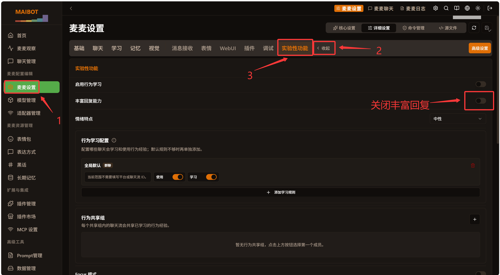
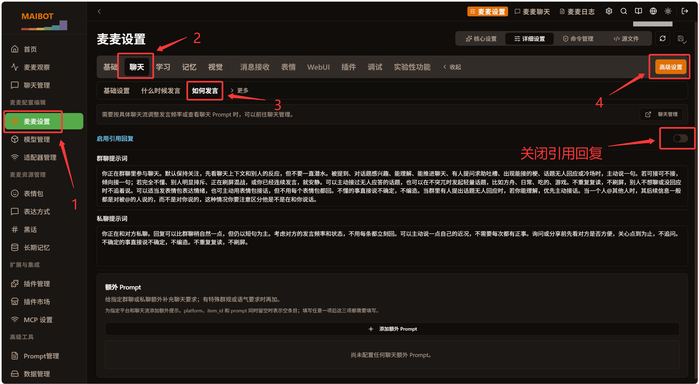
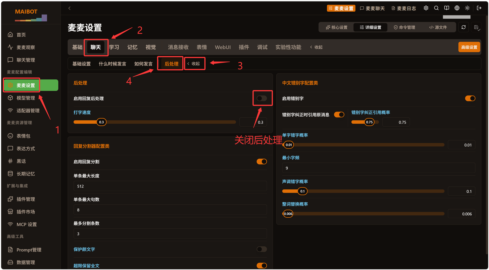

# 更好的消息后处理

## 使用前必读：先关掉宿主这几个开关（否则接管能力不生效）

> ⚠️ **本插件的两个「接管」能力（引用回复接管 / 后处理接管）不是装上就能用。**
> 它们要求宿主**关掉自己的原生能力** —— 否则宿主会先处理完，插件没有任何介入空间，
> 表现为**装了却一点效果都没有**（日志里对应模块会显示 `静默` 并写明原因）。
>
> 下面 3 个宿主开关**必须关闭**，顺序就是优先级：

| 优先级 | 要关闭的宿主开关 | 在哪里关 | 不关的后果 |
|---|---|---|---|
| **1️⃣ 最优先** | **丰富回复能力** | 麦麦设置 → **实验性功能** → 丰富回复能力 → 关 | **所有接管能力全部失效**（引用回复接管 + 后处理接管都不生效） |
| 2️⃣ | **启用引用回复** | 麦麦设置 → 聊天 → 如何发言 → **更多** → 高级设置 → 启用引用回复 → 关 | 「引用回复接管」失效 |
| 3️⃣ | **启用回复后处理** | 麦麦设置 → 聊天 → 后处理 → 启用回复后处理 → 关 | 「后处理接管」失效（分段 / 错别字纠正） |

> 如需查看指引教程的图片，请前往本地或仓库github查看，maibot的webui当前不支持加载本地静态资源

### 1️⃣ 关闭「丰富回复能力」（最关键，先关这个）

麦麦设置 → **实验性功能** → 把「丰富回复能力」的开关**关掉**：



> **为什么它最优先**：丰富回复开启后，回复工具会给消息挂图片 / 表情 / @ 等附件，分段与引用语义
> 都由富回复链路接管 —— 插件判定「首段文本」、注入引用都会与宿主打架。**不关它，下面两项关了也没用。**

### 2️⃣ 关闭「启用引用回复」

麦麦设置 → **聊天** → 「如何发言」→ 点右侧的 **更多** → 高级设置 → 把「启用引用回复」**关掉**：



> 📌 **「更多」与「收起」是同一个按钮**：**未展开时显示为「更多」，展开后才显示为「收起」。**
> 找不到高级设置时先点它展开 —— 折叠状态下长这样：
>
> 

### 3️⃣ 关闭「启用回复后处理」

麦麦设置 → **聊天** → **后处理** → 把「启用回复后处理」**关掉**：



### 关完之后应该看到什么

启动 / 热重载后，日志里这三行应该是「可用」：

```text
[模块状态｜启动] 引用回复接管：可用（启用引用回复已关闭、丰富回复已关闭）
[模块状态｜启动] 后处理接管：可用（启用回复后处理已关闭、丰富回复已关闭）
[模块状态｜启动] 回复后表情包：可用（不受宿主开关约束）
```

**其余功能（回复后表情包 / 表情包跟风 / 聊天流表情冷却 / 文本替换规则 / 表情包含义库）
不需要关闭宿主任何功能**，宿主开关任意状态都照常工作。

> 想「开着丰富回复也强行接管」时，把插件配置 `[plugin] rich_reply_gate` 关掉（默认开）——
> 代价见 [模块与前置条件（重要）](#模块与前置条件重要)。

---

Maibot出站消息增强插件，提供下列可分别开关的独立功能：

| 功能 | 默认 | 说明 |
|---|---|---|
| 后处理接管 | 开 | **需宿主关闭** `response_post_process.enable_response_post_process` **与** `experimental.enable_rich_reply`：以与 MaiBot 一致的原逻辑接管错别字注入 + 分段 + 颜文字保护 + 长度/句数守卫（参数沿用宿主 `response_splitter.*` / `chinese_typo.*` / `typing_speed`）；**各分段作为独立消息依次发送**（首段走宿主原生链路，其余由插件补发并模拟打字）；**错字纠正方式恒由权重池决定**（直接发送 / 引用纠正 / 撤回重发 / 不纠正，可延迟到最后；撤回前有「撤回反应时间」），`@昵称` 不会被错字污染、也不会重复 @ |
| 引用回复接管 | 开 | **需宿主关闭** `chat.reply_style.enable_reply_quote` **与** `experimental.enable_rich_reply`：为指向目标消息的回复**按权重**抽取发送方式：直接回复 / 引用回复 / @回复 / 引用＋@回复；**群聊与私聊权重、过旧规则、"同一消息只引用一次"记录各自独立**（私聊恒不 @） |
| 同一消息只引用一次 | 开 | 一条目标消息被引用过之后，之后对该消息的任何回复都不再引用（群聊/私聊分开记录）；抽到直接回复不消耗机会 |
| 回复后表情包 | 开 | planner 激活回复后，若整轮回复没有携带表情包，按概率补发一张（指定情绪标签或随机）；planner 本轮已计划发表情/贴表情、或本轮回复实际没发出时不补发 |
| 表情包跟风 | 开 | 群友连续发送 `threshold` 条表情包后，按配置方式跟发一张（与最后一个同情绪 / 指定情绪 / 纯随机）；不计入 bot 自身消息与插件注入的合成记录 |
| 文本替换规则 | 空 | 对 bot 发出的纯文本做词替换或整条覆盖，可配多条；默认只作用于 planner 拉起的回复流程，不碰其它插件直接发出的文本 |
| 表情包含义库 | 关闭 | 为表情包补录视觉模型生成的"准确内容"，并在发给模型的请求里把 `[表情包: 标签]` 改写成标签 + 内容描述（默认只改 replyer 请求） |

<!-- TOC -->

## 目录

- [使用前必读：先关掉宿主这几个开关（否则接管能力不生效）](#使用前必读先关掉宿主这几个开关否则接管能力不生效)
- [安装](#安装)
- [模块与前置条件（重要）](#模块与前置条件重要)
- [配置](#配置)
  - [配置板块总览](#配置板块总览)
  - [三条通用规则](#三条通用规则)
  - [取值范围与校验](#取值范围与校验)
  - [[plugin]](#plugin)
  - [[quote_reply] 引用回复](#quote_reply-引用回复)
  - [[quote_reply_weights] 引用回复 · 权重](#quote_reply_weights-引用回复--权重)
  - [[quote_reply_private] / [quote_reply_private_weights] 引用回复（私聊）](#quote_reply_private--quote_reply_private_weights-引用回复私聊)
  - [[chinese_typo] 错别字](#chinese_typo-错别字)
  - [[chinese_typo_weights] 错别字 · 纠正方式权重](#chinese_typo_weights-错别字--纠正方式权重)
  - [[response_splitter] 分段](#response_splitter-分段)
  - [[emoji_after_reply] 回复后表情包](#emoji_after_reply-回复后表情包)
  - [[emoji_follow] 表情包跟风](#emoji_follow-表情包跟风)
  - [[emoji_cooldown] 聊天流表情包冷却](#emoji_cooldown-聊天流表情包冷却)
  - [[text_rules] 文本替换规则](#text_rules-文本替换规则)
  - [[emoji_meaning] 表情包含义库](#emoji_meaning-表情包含义库)
  - [WebUI 显示与翻译（0.6.1；提示文本 0.11.1）](#webui-显示与翻译061提示文本-0111)
- [与框架的分工](#与框架的分工)
- [与其它插件共存](#与其它插件共存)
  - [与「智能分段插件」(saberlights/smart_segmentation_plugin)](#与智能分段插件saberlightssmart_segmentation_plugin)
  - [与其它出站类插件](#与其它出站类插件)
- [能力声明（capabilities）](#能力声明capabilities)
- [开发](#开发)
- [参考实现与出处](#参考实现与出处)
- [作者与许可](#作者与许可)
- [致谢](#致谢)

<!-- /TOC -->

## 安装

把整个 `cateye_better_post-processing` 目录放进 MaiBot 安装目录的 `plugins/` 下，
然后重启 MaiBot（或在 WebUI 插件管理中启用本插件）。

> 本插件使用的 Hook 与能力（`send_service.before_send` / `send_service.after_build_message` /
> `send_service.after_send`、`maisaka.reply.before_post_process`、
> `maisaka.planner.before_request`、`maisaka.planner.after_response`、
> `maisaka.replyer.before_request`、`chat.receive.before_process`、`chat.receive.after_process`、
> `emoji.register.after_build_description`、`message.get_by_id`、`message.get_by_time_in_chat`、
> `emoji.*`、`database.query`、`llm.generate`、`send.emoji`、`send.text`、
> `api.call`）在 MaiBot 1.2.3 / maibot_sdk 2.8.0 上验证。manifest 声明的最低宿主版本为 1.2.3。
>
> 多段发送（`[response_splitter]` 的 `takeover`）需要 `send.text` 能力，
> 「撤回重发」纠错分支需要 `api.call` 能力，**改动过 manifest 需完整重启 MaiBot**。

## 日志（部署后排查用）

本插件会把**自己的全部日志**（含 `debug` 级）落到**插件目录下**：

```text
plugins/cateye_better_post-processing/logs/plugin.log        # 当前日志
plugins/cateye_better_post-processing/logs/plugin.log.1      # 滚动的历史（越新编号越小，最多 5 份）
```

单行格式（便于 grep）：

```text
2026-09-24 01:13:31.386 [WARNING] 读取宿主配置 response_splitter.max_split_num 失败，使用默认值 4: …
2026-09-24 01:13:31.387 [INFO] 回复轮登记 #12（会话 205a4644cf4f）：目标消息=1827141068，本轮已有表情包=False，…
2026-09-24 01:13:32.104 [INFO] 表情包标签已替换为含义库描述：8 处（replyer 请求，会话 205a4644cf4f）
```

- **单文件 8MB 自动滚动、保留 5 份**（约 48MB 上限），跑几小时绰绰有余；
- **插件目录不可写时**只打一条 warning，日志照常进宿主日志，不影响插件运行；
- 加载日志里会打印实际路径：`插件文件日志：<路径>（含 debug 级，8MB 滚动 ×6 份）`。

### 复查时按功能 grep

| 想看什么 | grep 关键字 |
|---|---|
| 插件启动 / 配置 / 模块是否可用 | `插件已加载`、`宿主配置快照已刷新`、`模块状态` |
| 引用回复接管 | `回复方式=`、`回复轮登记`、`本轮回复判定`、`回复目标查询` |
| 后处理接管（分段 / 错字） | `后处理接管`、`共 \d+ 段`、`错字`、`补发完成` |
| 回复后表情包 | `回复后表情包`、`补发`、`安静`、`planner 已计划` |
| 表情包跟风 | `跟风`、`连击`、`忽略自身` |
| 表情包含义库 | `planner 按需补录`、`含义生成`、`含义注入`、`已收录表情包含义`、`淘汰` |
| 宿主配置读取失败（会退到兜底值） | `读取宿主配置`、`失败，使用默认值` |
| 任何异常 | `失败`、`异常`、`放弃`、`警告` |

> **注意**：`send_service` 的出站日志预览会把连续空白折叠成一个空格
> （`_build_outbound_log_preview` 的 `" ".join(text.split())`），**核对 @ 后空格数要看本插件的
> `前缀组件 [at:…, text:'…']` 那行**，不要看宿主日志的 `message=…`。

## 模块与前置条件（重要）

> 📌 **图文操作步骤（含宿主设置截图）见 [使用前必读](#使用前必读先关掉宿主这几个开关否则接管能力不生效)**；
> 本节是同一件事的**规则化说明**（哪个模块需要哪些宿主配置、读不到配置时怎么处理）。

插件按"接管对象"拆成独立模块（代码在 `modules/` 子目录）。**两个接管模块必须由宿主关闭对应能力
才会工作**——否则即使插件配置里把它们打开，模块也会**完全静默**：不改写文本、不抽取回复方式、
不发任何消息。启动时与**每次配置变更时**都会在日志里打印各模块的可用状态：

```text
[模块状态｜启动] 引用回复接管：静默（需在宿主配置关闭「丰富回复」（experimental.enable_rich_reply，当前 True））
[模块状态｜启动] 后处理接管：可用（启用回复后处理已关闭、丰富回复已关闭）
[模块状态｜启动] 回复后表情包：可用（不受宿主开关约束）
```

| 模块 | 需要的宿主配置（**全部满足**才可用） | 是否受制 |
|---|---|---|
| 引用回复接管（`quote_reply`） | `chat.reply_style.enable_reply_quote = false` 且 `experimental.enable_rich_reply = false` | 受制 |
| 后处理接管（`response_splitter`） | `response_post_process.enable_response_post_process = false` 且 `experimental.enable_rich_reply = false` | 受制 |
| 回复后表情包 / 表情包跟风 / 表情包含义库 / 文本替换规则 | —— | **不受制**，宿主开关任意状态都照常工作 |

> **为什么两个接管都要关「丰富回复」**：开启后回复工具会给消息挂图片/表情/@ 等附件，分段与引用语义
> 都由富回复链路接管，插件的"首段文本"判定与引用注入会与宿主打架。这也是官方文档要求的使用前提。
>
> 想"开着丰富回复也要接管"时，把插件配置 `[plugin] rich_reply_gate` 关掉即可（默认开）：
> 此时不再把丰富回复当硬门槛，状态行会写成 `可用（…、丰富回复未做门控）`。代价是附件只挂在
> **首段**、补发分段不带附件，与宿主原生"附件挂最后一段"的语义不同，请自行确认可接受。
>
> 读不到宿主配置时（能力异常）按**未满足**处理，模块保持静默并在日志里写明原因——宁可少做事，
> 也不要和宿主原生能力重复处理同一条消息。
>
> 日志级别：可用模块用 `info`、**静默模块用 `warning`**——"配置打开了却什么都不做"最难排查，
> 静默原因必须显眼。

## 配置

配置文件位于 `plugins/cateye_better_post-processing/config.toml`（或 WebUI 插件配置页）。

### 配置板块总览

**按功能板块排版**（`config.toml` 里的分节顺序就是这个）：

| 顺序 | 板块 | 内容 |
|---|---|---|
| 1 | `[plugin]` | 插件开关、跨板块门控（丰富回复门控 / 过滤假 @）与配置版本 |
| 2 | `[quote_reply]` | 引用回复：什么时候接管、目标过旧怎么处理、引用去重 |
| 3 | `[quote_reply_weights]` | 引用回复的**权重** |
| 4 | `[quote_reply_private]` | 引用回复（私聊） |
| 5 | `[quote_reply_private_weights]` | 私聊引用回复的**权重** |
| 6 | `[chinese_typo]` | 错别字：注入参数 + 纠正行为 |
| 7 | `[chinese_typo_weights]` | 错字**纠正方式权重** |
| 8 | `[response_splitter]` | 分段：分割参数 + 打字速度 + 接管机制 |
| 9 | `[emoji_meaning]` | 表情包含义库（排在"分段"与"回复后表情包"之间） |
| 10 | 其它功能 | `[emoji_after_reply]` / `[emoji_follow]` / `[text_rules]` / `[emoji_cooldown]` |

### 三条通用规则

1. **不区分"宿主提供的"还是"插件提供的"**：同一个功能的开关都放同一个板块；宿主本来就有的参数
   用宿主的字段名与说明（宿主 WebUI 上叫什么，这里就叫什么）。
2. **权重单独成板块**，紧跟在它的功能板块之后。
3. **留空 = 跟随宿主**：数值项留空（空字符串）、开关项选「跟随宿主」、文本项留空，都表示用宿主配置里
   的值；填了值就以插件为准。**首次生成 `config.toml` 时插件会读宿主 `config/bot_config.toml` 的现值
   填进去**，所以默认看到的就是宿主当前值（想重新跟随宿主就把它清空）。每项都带一句行尾中文注释，
   同一句文案也会作为 WebUI 的**提示文本**显示（见下方「WebUI 显示与翻译」）。

   #### 镜像字段的四级取值链路（重要）

   "跟随宿主"不是一句空话 —— 它有一整条降级链，**前一级拿不到才退下一级**：

   | 级别 | 情形 | 用哪个值 |
   |---|---|---|
   | ① | 插件配置里**填了具体值** | 用插件填的（用户显式覆盖，最优先） |
   | ② | 插件配置**留空**（`""` / 「跟随宿主」） | 用宿主**运行时**配置快照（`ctx.config.get`） |
   | ③ | 宿主快照**读不到**（能力异常 / 精简快照） | 退到 `modules/post_process_takeover.py` 的 `_POST_PROCESS_CONFIG_KEYS` **第 3 列** |
   | ④ | 第 3 列即**最终代码层兜底** | 取自**发布者实机在用的 `config.toml`** |

   也就是说：**插件配置默认留空 → 留空即跟随宿主 → 跟随宿主失败才用代码兜底**。
   第 3 列刻意用"发布者实机验证过的一套参数"而不是宿主官方默认值，这样在宿主配置读不到时
   得到的是**可用且符合预期**的行为。插件填了非法值（如数字框里写了 `abc`）同样按 ②→③ 降级。

   | 兜底项 | 值 |
   |---|---|
   | `response_splitter.enable` / `max_length` / `max_sentence_num` / `max_split_num` | `true` / `512` / `8` / **`4`** |
   | `response_splitter.enable_kaomoji_protection` / `enable_overflow_return_all` | `false` / **`true`** |
   | `chinese_typo.enable` / `error_rate` / `min_freq` / `tone_error_rate` / `word_replace_rate` | `true` / `0.01` / `9` / `0.1` / `0.006` |
   | `bot.nickname`（→ `fallback_nickname`） / `response_post_process.typing_speed` | **`普瑞赛斯`** / `1.0` |

   #### 镜像字段的四级取值链路（重要）

   "跟随宿主"不是一句空话 —— 它有一整条降级链，**前一级拿不到才退下一级**：

   | 级别 | 情形 | 用哪个值 |
   |---|---|---|
   | ① | 插件配置里**填了具体值** | 用插件填的（用户显式覆盖，最优先） |
   | ② | 插件配置**留空**（`""` / 「跟随宿主」） | 用宿主**运行时**配置快照（`ctx.config.get`） |
   | ③ | 宿主快照**读不到**（能力异常 / 精简快照） | 退到 `modules/post_process_takeover.py` 的 `_POST_PROCESS_CONFIG_KEYS` **第 3 列** |
   | ④ | 第 3 列即**最终代码层兜底** | 取自**发布者实机在用的 `config.toml`** |

   也就是说：**插件配置默认留空 → 留空即跟随宿主 → 跟随宿主失败才用代码兜底**。
   第 3 列刻意用"发布者实机验证过的一套参数"而不是宿主官方默认值，这样在宿主配置读不到时
   得到的是**可用且符合预期**的行为。插件填了非法值（如数字框里写了 `abc`）同样按 ②→③ 降级。

   | 兜底项 | 值 |
   |---|---|
   | `response_splitter.enable` / `max_length` / `max_sentence_num` / `max_split_num` | `true` / `512` / `8` / **`4`** |
   | `response_splitter.enable_kaomoji_protection` / `enable_overflow_return_all` | `false` / **`true`** |
   | `chinese_typo.enable` / `error_rate` / `min_freq` / `tone_error_rate` / `word_replace_rate` | `true` / `0.01` / `9` / `0.1` / `0.006` |
   | `bot.nickname`（→ `fallback_nickname`） / `response_post_process.typing_speed` | **`普瑞赛斯`** / `1.0` |

> 唯一**故意不搬**的是宿主 `[response_post_process] enable_response_post_process`：它是本插件的
> **生效条件**（宿主开着它时宿主自己做后处理，插件必须让位），不是可以随便改的参数。

### 取值范围与校验

所有数值项的合法范围写在下表；**超范围的值会被配置校验直接拒绝**（Pydantic `ValidationError`，
不是静默截断成边界值），WebUI 输入框也带同样的 min/max。留空（空字符串）= 跟随宿主，不受数值范围约束。

| 板块 | 字段 | 取值范围 | 含义 |
|---|---|---|---|
| `[quote_reply]` | `force_direct_threshold_messages` | `0~` | 强制直发阈值（条） |
| `[quote_reply]` | `stale_threshold_messages` | `0~` | 对话已推进阈值（条） |
| `[quote_reply]` | `stale_age_seconds` | `0~` | 目标超时后强制直接回复（秒） |
| `[quote_reply_weights]` | `weight_direct` | `0~` | 权重：直接回复 |
| `[quote_reply_weights]` | `weight_quote` | `0~` | 权重：引用回复 |
| `[quote_reply_weights]` | `weight_at` | `0~` | 权重：@回复 |
| `[quote_reply_weights]` | `weight_quote_at` | `0~` | 权重：引用＋@回复 |
| `[quote_reply_private]` | `force_direct_threshold_messages` | `0~` | 强制直发阈值（条） |
| `[quote_reply_private]` | `stale_threshold_messages` | `0~` | 对话已推进阈值（条） |
| `[quote_reply_private]` | `stale_age_seconds` | `0~` | 目标超时后强制直接回复（秒） |
| `[quote_reply_private_weights]` | `weight_direct` | `0~` | 权重：直接回复 |
| `[quote_reply_private_weights]` | `weight_quote` | `0~` | 权重：引用回复 |
| `[chinese_typo]` | `correction_max_cjk` | `0~` | 超限不纠错 |
| `[chinese_typo_weights]` | `weight_correction_direct` | `0~` | 权重 · 直接发送 |
| `[chinese_typo_weights]` | `weight_correction_quote` | `0~` | 权重 · 引用纠正 |
| `[chinese_typo_weights]` | `weight_correction_recall` | `0~` | 权重 · 撤回重发 |
| `[chinese_typo_weights]` | `weight_correction_none` | `0~` | 权重 · 不纠正 |
| `[chinese_typo_weights]` | `last_correction_probability` | `0~1` | 最后纠正概率 |
| `[emoji_after_reply]` | `probability` | `0~1` | 补发概率 |
| `[emoji_after_reply]` | `quiet_seconds` | `0.5~` | 静默判定时长（秒） |
| `[emoji_after_reply]` | `round_window_seconds` | `1~` | 回复轮窗口（秒） |
| `[emoji_after_reply]` | `first_send_timeout_seconds` | `0~` | 首条出站等待（秒） |
| `[emoji_after_reply]` | `planned_emoji_ttl_seconds` | `5~` | planner 表情标记有效期（秒） |
| `[emoji_follow]` | `threshold` | `1~` | 触发条数 |
| `[emoji_follow]` | `probability` | `0~1` | 跟发概率 |
| `[emoji_follow]` | `streak_window_seconds` | `10~` | 连击保鲜（秒） |
| `[emoji_cooldown]` | `seconds` | `0~` | 冷却时长（秒） |
| `[emoji_meaning]` | `max_tokens` | `32~4096` | 生成 max_tokens |
| `[emoji_meaning]` | `worker_interval_seconds` | `5~` | 生成循环间隔（秒） |
| `[emoji_meaning]` | `batch_size` | `1~50` | 每轮生成条数 |
| `[emoji_meaning]` | `max_attempts` | `1~20` | 失败重试上限 |
| `[emoji_meaning]` | `max_meaning_length` | `20~1000` | 单条含义最大长度 |
| `[emoji_meaning]` | `rewrite_scope` | — | 标签替换范围（`replyer` / `planner`，默认两者都开） |

> 共 33 项有范围约束（配置面共 79 项）；其余项是布尔 / 三态开关 / 文本 / 列表，不受数值范围限制。
> 例外：`[chinese_typo] recall_delay_seconds`（撤回反应时间）不设范围校验——留空 = 按打字速度自动，
> 填数字（支持小数点）就用它，负数按 `0` 处理。

### `[plugin]`

`enabled` 控制插件总开关；`config_version` 由插件维护，请勿手改。

`rich_reply_gate`（0.10.2 新增，默认 `true`）控制两个接管是否把宿主「丰富回复」
（`experimental.enable_rich_reply`）当硬门槛。默认开启时，宿主开着丰富回复 → 两个接管静默
（原因见[模块与前置条件](#模块与前置条件重要)）；关掉本项后不再门控，代价是富回复附件只挂在首段。

`filter_fake_at`（0.12.1 新增，默认 `true`）**过滤假 @**：LLM 会在正文里手写「@某人」，
那只是普通文本——宿主与适配器都**不会**把它转成真实 at 段，QQ 里不会提醒任何人
（模型是照抄宿主渲染进上下文的「@昵称」）。开启后插件在出站前把**消息开头**的
「@某人 + 空格」整段删掉，这样「引用回复接管」抽到 @ 时注入的**真实 @** 才是消息里唯一的一个。
两个限定条件同时满足才动手：① 在消息正文最前面；② `@名字` 后面跟着空格（半角/全角空格、Tab、NBSP）。
所以 `a@b.com`、`@某人，` 这类写法不会被误伤；删完只剩空白时也不删（免得发出空消息）。
作用范围与文本规则一致（只动 bot 本轮回复自己发出的消息，含插件补发的分段），
并**与两个接管同口径受「丰富回复门控」约束**。


**`[plugin]` 字段表**（默认值 / 说明与 `config.toml` 行尾注释、WebUI 提示同源）：

| 字段 | 默认 | 说明 |
|---|---|---|
| `enabled` | `True` | 是否启用本插件。 |
| `rich_reply_gate` | `True` | 开启时：宿主开着「丰富回复」就不接管（附件与分段语义冲突）。 |
| `filter_fake_at` | `True` | 删掉正文开头的「@某人 + 空格」（LLM 手写的纯文本 @，不提醒人）。 |
| `at_trailing_space` | `False` | 注入真实 @ 时是否额外补一个空格组件。**按宿主版本选**：**MaiBot 1.2.5 起关闭**（宿主富回复自己会在每个 @ 组件后插一个空格组件）；**1.2.5 以前（不含 1.2.5）开启**（那时宿主不插，插件不补会与正文粘连）。开启后宿主渲染的纯文本里会出现三个空格。 |
| `config_version` | `'0.12.1'` | 配置版本，与插件版本同步（自动维护，不要手改）。 |

### `[quote_reply]` 引用回复

> **⚠️ 生效前提**：需先关闭宿主 **「丰富回复能力」**（麦麦设置 → 实验性功能）与 **「启用引用回复」**（麦麦设置 → 聊天 → 如何发言 → 更多 → 高级设置），否则本模块**完全静默**、不介入任何消息。图文步骤见 [使用前必读](#使用前必读先关掉宿主这几个开关否则接管能力不生效)。

| 字段 | 默认 | 说明 |
|---|---|---|
| `takeover` | `true` | 宿主【启用引用回复】关闭**且** `experimental.enable_rich_reply` 关闭时，由插件为指向目标消息的回复按权重抽取发送方式；任一未关闭则本模块**静默** |
| `force_direct_threshold_messages` | `2` | **强制直发阈值（条）**：目标之后已出现的消息数**未达到** N 条（对话还很新）时强制直接回复——即**不引用、也不 @**。`0` = 关闭。必须**小于**「对话已推进阈值」：配置值 ≥ 旧阈值时自动为旧阈值让步，压到「对话已推进阈值 − 1」（旧阈值 3、本项填 4 时按 2 生效） |
| `stale_threshold_messages` | `3` | **对话已推进阈值（条）**：目标之后出现 ≥N 条消息即视为「对话已推进」：剔除直接回复，并把 @ 权重按权重板块里的「推进时 @ 权重」调整。`0` = 关闭。与「强制直发阈值」互补：消息数不足直发阈值时强制直发，达到推进阈值后剔除直发 |
| `stale_exclude_bot_messages` | `false` | 统计"目标之后的消息数"时是否不数 bot 自己发的消息（「强制直发」与「对话已推进」两条阈值共用同一次统计） |
| `stale_age_seconds` | `1800.0` | 回复目标发出超过 N 秒后**强制直接回复**——即**不引用、也不 @**，纯文本发出去（就是权重里的「直接回复」，**不是**"以引用的方式发"）。`0` = 关闭；优先级高于上面的推进判定 |
| `quote_once_per_target` | `true` | **同一消息只引用一次**：一条目标消息被引用过之后，后续回复不再引用它（抽到直接回复不消耗机会）。与群聊/私聊各自独立记录 |
| `style_once_per_target` | `true` | **回复方式只取首条**：只有对该目标消息的**第一条**回复能抽到 @，避免"前一条什么都没挂、后一条才 @ 人"的错位 |

#### 同一消息只引用一次（`quote_once_per_target`，群聊/私聊各自独立）

一条目标消息被引用过（本插件抽到引用/引用＋@，或被观测到以引用方式发出）之后，之后对该消息的任何
回复都不再引用它（只可能直接回复或 @）。抽到"直接回复"**不消耗**这次机会。该规则优先于
「目标超时后强制直接回复」。

#### @ 与正文之间的空格（四条路径 + 平台侧口径，0.13.17 起全统一）

插件往消息里加 @ 一共只有**四条路径**（都经由唯一的 `_inject_at_component`），
**0.13.17 起它们的空格口径已经全部对齐**：

| # | 路径 | 触发条件 | 组件产物 | 平台载荷（QQ，at 段**不带**尾随空格） |
|---|---|---|---|---|
| **①** | **注入** | 正文开头**没有** @ | `at_trailing_space=false` → `[at, 正文]`；`true` → `[at, ' ', 正文]` | `false` → `@昵称正文`（粘连）；`true` → `@昵称 正文` ✓ |
| **②** | **字面升级** | 开头是**字面** `@目标昵称` | 同 ①（先删字面再插真实 at） | 同 ① |
| **③** | **跳过** | 开头是**字面 `@别人`** | 原样保留（**0.13.17 起**把字面 @ 后的空白规范成**恰好一个半角空格**） | **恒定 1 个** ✓ |
| **④** | **只规范化** | 消息里**已有真实 at**（宿主 `attach_at` / 别的插件） | 同 ① | 同 ① |

```text
回复方式=at（注入 @）：前缀组件 [at:某人, text:'正文']（会话 …，引用=…）
回复方式=quote_at（字面 @ 升级为真实 @）：前缀组件 [at:某人, text:'正文']（会话 …）
回复方式=quote_at（正文开头已有字面 @张三，不是本轮目标，跳过 @ 注入，仅统一空格）：…（会话 …）
回复方式=at（消息已有 @，仅统一空格）：前缀组件 [at:某人, text:'正文']（会话 …）
回复方式=quote（消息已有 @，无需改动）（会话 …）
```

> **0.13.17 修的是什么**：③ 这条路原来"原样发出"，于是那条消息的空格数**完全由模型写的文本决定**
> （实测 0 / 1 / 2 个都可能），而 ①②④ 的空格数是**恒定**的 —— 两条路口径不一致，
> 群里就会看到"有时候 @ 后没空格、有时候一个、有时候两个"。现在 ③ 也对齐到"恰好一个"。
>
> **`at_trailing_space` 在 1.2.3 上要开启**：宿主 1.2.3 的 at 段在平台上**不**自带空格，
> 关掉本项会让 ①②④ 的 @ 与正文**粘连**（`@昵称正文`）。开启后平台侧恰好一个空格，
> 代价只是宿主渲染的纯文本里多出空格（见下方"代价说明"）。

> **为什么不能插空格组件**：宿主 `send_service._build_processed_plain_text()` 用
> `" ".join(parts)` 拼接出站纯文本 —— **组件之间自己会补一个空格**。插一个空格组件会变成
> `@昵称` + join空格 + `' '` + join空格 + `正文` = **三个空格**，而且会跟着
> `processed_plain_text` 进消息库、上下文与记忆抽取。
>
> **注意日志会骗人**：`_build_outbound_log_preview()` 用 `" ".join(text.split())` 折叠了连续空白，
> 所以**出站日志里永远只显示一个空格** —— 要核对空格数量只能看组件结构（本插件那行
> `前缀组件 [at:…, text:'…']`）或渲染后的纯文本。

##### `at_trailing_space`：按宿主版本选（1.2.5 是分界线）

官方文档 `MaiBot插件开发文档v1.2.5` 记载了这条行为变更（附录 B-5【行为变更】）：

> **1.2.5 起，Maisaka 富回复在拼接 `attach_at` 组件时，会在每个 @ 组件后插入一个空格组件**
> （`src/maisaka/builtin_tool/context.py:428-432`）：
> ```python
> at_prefix_components.extend([at_component, TextComponent(" ")])
> ```
> 1.2.3 是 `items[0].sequence.components = at_components + items[0].sequence.components`（**无空格**）。

| 宿主版本 | 宿主自己插空格？ | [`[plugin] at_trailing_space`](#plugin) |
|---|---|---|
| **1.2.5 及以后** | ✅ 每个 @ 组件后插一个 | **关闭（默认）** |
| **1.2.5 以前（不含 1.2.5）** | ❌ 不插 | **开启** |

> **代价说明**：宿主渲染出站纯文本用的是 `" ".join(每个组件)`，所以**开启后**纯文本里
> `@昵称` 与正文之间会有**三个空格**（并跟着 `processed_plain_text` 进消息库、上下文与记忆抽取）。
> 这是「平台侧 @ 与正文不粘连」与「纯文本好看」之间的取舍；1.2.5+ 的宿主把两件事都接管了，
> 插件不需要再操心。

> 正文里**本来就有的**假 @（LLM 手写的文本 `@某人 `）默认会在出站前被删掉，见
> [`[plugin] filter_fake_at`](#plugin)；关掉它时本插件的 @ 判重仍然生效（命中本轮目标就把它
> 升级成真实 at 组件、@ 的是别人则跳过注入），所以一条消息里也不会出现两个 @。

### `[quote_reply_weights]` 引用回复 · 权重

按权重抽取这条回复怎么引用：`weight_direct`（**直接回复 = 不引用也不 @**，默认 `5`）/ `weight_quote`（引用，默认 `1`）/ 
`weight_at`（@ 对方，默认 `2`）/ `weight_quote_at`（引用＋@，默认 `4`）；全为 0 时回退为"仅引用回复"。

`stale_at_weight`：**「对话已推进」时 @ 类回复的权重**，三档语义（与 WebUI 标签一致；`0` **真的**是不再 @）：

| 填法 | `at`（纯 @） | `quote_at`（引用＋@） |
|---|---|---|
| **留空** | 取原值的一半 | 不动 |
| **正数**（如 `3`） | 取该值 | 不动 |
| **`0`** | `0`（不再纯 @） | **也归 `0`**（不再「引用＋@」） |

（刻意不用 `-1` 这类负数哨兵。）

### `[quote_reply_private]` / `[quote_reply_private_weights]` 引用回复（私聊）

私聊只有「直接回复 / 引用回复」两种（QQ 私聊不会出现 @），因此权重板块只有
`weight_direct`（默认 `4`）/ `weight_quote`（默认 `2`）。功能项与群聊**同名同义**（去重与过旧判定各自独立记录），
但**比群聊少一项**：私聊没有 `style_once_per_target`，因为私聊不存在 @，
**"回复方式只取首条"对私聊恒等效**（抽到 @ 的机会本来就没有），所以不对外暴露。


**`[quote_reply_private]` 字段表**（默认值 / 说明与 `config.toml` 行尾注释、WebUI 提示同源）：

| 字段 | 默认 | 说明 |
|---|---|---|
| `takeover` | `True` | 私聊也按权重决定怎么引用（私聊恒不 @）。 |
| `force_direct_threshold_messages` | `3` | **强制直发阈值（条）**：目标之后已出现的消息数**未达到** N 条时强制直接回复（不引用；私聊恒不 @）。0 = 关闭。须小于「对话已推进阈值」，超出时自动压到其 −1。 **取值范围** `0~`。 |
| `stale_threshold_messages` | `5` | **对话已推进阈值（条）**：被回复消息之后又来了这么多条消息（≥N），就算「对话已推进」：不再直发。0 = 不判定。 **取值范围** `0~`。 |
| `stale_exclude_bot_messages` | `True` | 统计「强制直发」与「对话已推进」两条阈值时是否不数 bot 自己发的消息。 |
| `stale_age_seconds` | `1800.0` | 被回复的消息发出超过这么多秒后，本次回复既不引用也不 @（就是「直接回复」）。0 = 不判定。 **取值范围** `0~`。 |
| `quote_once_per_target` | `True` | 同一条目标消息只引用一次，后续回复不再引用它。 |

### `[chinese_typo]` 错别字

> **⚠️ 生效前提**：本模块属于**后处理接管**，需先关闭宿主 **「丰富回复能力」**（麦麦设置 → 实验性功能）与 **「启用回复后处理」**（麦麦设置 → 聊天 → 后处理），否则**完全静默**。图文步骤见 [使用前必读](#使用前必读先关掉宿主这几个开关否则接管能力不生效)。

| 字段 | 默认 | 说明 |
|---|---|---|
| `enable` | `跟随宿主` | 宿主【启用错别字】：让麦麦偶尔打错字。关闭后不会注入错字，也就不会有纠正消息 |
| `error_rate` | 留空 | 宿主【单字错字概率】：**错字出现的总频率**（这是唯一的"错字概率"）。留空 = 跟随宿主（宿主默认 `0.01`）；想更容易看到错字就调大（如 `0.05`~`0.1`） |
| `min_freq` | 留空 | 宿主【最小字频】：只对常见程度达到该值的字尝试制造错字 |
| `tone_error_rate` | 留空 | 宿主【声调错字概率】：按相近声调制造错字的概率 |
| `word_replace_rate` | 留空 | 宿主【整词替换概率】：整词被替换成错词的概率 |
| `correction_max_cjk` | `20` | **超限不纠错**：某段汉字数超过该值时不纠正（错字留着）；`0` = 不限制 |
| `recall_fallback` | `quote` | 撤回失败时的兜底：`quote` 改成引用发送 / `direct` 直接发送 / `none` 放弃这条纠正 |
| `recall_delay_seconds` | 留空 | **撤回反应时间**（秒，支持小数点）：要撤回重发时先等这么久再撤回。留空 = 按打字速度自动（用被撤回那条的正文按宿主公式算）；`0` = 立刻撤回 |

> **没有第二个错字概率**：宿主代码里那半句「抽到纠正建议后 50% 发错字 / 50% 整句换成正确句」的门控
> **照抄硬编码 0.5**，不对外暴露——错字多久出现一次只看 `error_rate`。
> **另一半**门控（宿主"50% 才给纠正建议"）在接管分支里**已绕过**：只要错字真的出现，就一定会抽一次
> 纠正方式，否则会出现"打了错字却既不纠正也不撤回"（0.11.3 线上实测）。

> **0.12.0 移除的三项**：`enable_correction_quote`（错别字纠正时引用原消息）、
> `correction_quote_probability`（错别字纠正引用概率）与 `correction_mode_enabled`（错字纠正方式开关）
> ——只要接管生效，**纠正方式与"是否引用"一律由权重池决定**；另有实测无效的 `recall_purge`
> （撤回后清理原消息）一并移除。

> **与宿主唯一有意不同的一处**（0.11.2）：整词同音替换（`word_replace_rate`）在宿主里用
> `itertools.product` **无上限**穷举"每个字的同音字组合"，组合数随词长指数爆炸（「中华人民共和国」
> 约 11.5 亿、「社会主义现代化」约 5028 亿），一旦命中就会把工作线程占住几分钟到几小时。
> 本插件加了组合数硬上限（20 万），超限就跳过**该词**的整词替换（逐字错字照常），
> 并在「后处理接管统计」日志里以 `整词替换跳过=N(累计)` 提示。常用词（≤4 字）组合数远低于上限，
> 行为与宿主完全一致。

#### 错字纠正方式（恒由权重池决定）

宿主原生只会「抽到纠正建议 → 追加一条更正消息」。0.12.0 起（`correction_mode_enabled` 开关已移除）
**每处真正出现的错字**都会按权重抽取一次纠正方式：

| 方式 | 群里看到的样子 |
|---|---|
| 直接发送 | 错字消息之后紧跟一条纠正内容（不引用） |
| 引用纠正 | 紧跟一条纠正内容，**引用**那条带错字的消息（宿主原生观感） |
| 撤回重发 | **撤回**那条带错字的消息，然后重发**修正后的整句**（撤回后必须给完整内容） |
| 不纠正 | 错字留在消息里，不发任何纠正（想完全不纠正：把四个权重都设 `0`） |

「最后纠正」**不在这个权重池里**——它是**时机**而不是方式：`last_correction_enabled` 打开后，
抽到的纠正按 `last_correction_probability` 决定是否推迟到**本轮全部分段发完之后**再执行；
推迟后依然按抽到的那个方式纠正（直接补发 / 引用纠正 / 撤回重发），**不再强制引用**；
抽到「不纠正」时什么都不会发生。

**顺序保证（发送前定好）**：所有纠正方式在分段全部发出**之前**一次算完，动作序列是
`第 1 段（宿主发） → 它的纠正 → 第 2 段 → 它的纠正 → …`，所以"第二段出了错字"的纠正一定在
**第三段发出之前**完成；只有"最后纠正"按定义排在全部段之后。

注意事项：

- 需要后处理接管生效（`[response_splitter] takeover`，且宿主【启用回复后处理】关着）。
- **纠正是否引用完全由权重池决定**：宿主的 `enable_correction_quote` / `correction_quote_probability`
  已从插件配置里移除（0.12.0）；想"纠正一律不引用"就把 `weight_correction_quote` 设为 `0`。
- **撤回反应时间**（`recall_delay_seconds`）：撤回重发前先等这么久（秒，支持小数点）——模拟
  "发出去才发现打错"。留空 = 按打字速度自动（拿被撤回那条的正文按宿主打字公式算）。
- **每处错字都一定会抽一次纠正方式**：宿主那句"50% 才给纠正建议"的门控在接管分支里已绕过，
  不会再出现"打了错字却既不纠正也不撤回"（0.11.3 线上实测的问题）。
- **`@昵称` 不会被错字污染**：正文里的 `@某人` 不参与错字生成（宿主会把它一起改错，
  于是"@凯特艾"变成"@凯特爱"，群里看起来像 @ 了两个人）。这是本插件与宿主**有意不同**的一处。
- 宿主"正常撤回"**不会**删除原消息——NapCat 的 `group_recall` 只是被适配器包成一条
  `is_notify` 通知消息入库（"[事件] xxx 撤回了一条消息"），原消息仍在库里与上下文里。
  （0.11.3 曾试图"撤回后清理原消息"，实测**无效**：宿主发出的第 1 段由宿主自己写历史、插件拦不住，
  删库也改不了内存上下文，因此该功能与配置项 `recall_purge` 一并移除。）
- 撤回走适配器公开 API（`adapter.napcat.message.delete_msg`，napcat 与 SnowLuma 都提供），
  失败按 `recall_fallback` 兜底。**该能力必须在 manifest 声明 `api.call`**（0.11.2 前漏声明，
  导致「撤回重发」静默失效；见[能力声明](#能力声明capabilities)）。

#### 错字「改了配置却没反应」怎么查

插件每次回复都会打两行日志，直接说明"到底有没有生成错字"：

```text
后处理接管参数：分段enable=True(宿主值) 长度=… 句数=… 条数=… 颜文字=… 超限全文=… | 错字enable=True(宿主值) error_rate=0.01(宿主值) min_freq=9(宿主值) tone=…(宿主值) word=…(宿主值) 昵称=麦麦(宿主值)
后处理接管统计：宿主开关[分段=True 错字=True] 生效参数[错字总开关=True error_rate=0.01(源宿主值) …] → 真出现错字=1 句、判定纠正=1 处（纠正方式=权重池）、共 2 段
```

| 日志现象 | 含义 / 怎么办 |
|---|---|
| `错字enable=False` | 宿主【启用错别字】关着，或 `[chinese_typo] enable = "关闭"` |
| `真出现错字=0`（很多轮都这样） | 错字压根没生成：`error_rate` 太小、`min_freq` 太高，或 `depends-data/char_frequency.json` 异常 |
| `真出现错字>0` 但 `判定纠正=0` | 权重池抽到了「不纠正」（正常）；想每次都纠正就把 `weight_correction_none` 设为 `0` |
| 回复里明明有错字、但 `真出现错字=0` | 宿主那半句"抽到建议 → 50% 整句替换成正确句"的门控生效（正常行为） |
| 参数行写 `(插件值)` | 该值来自插件配置（不是跟随宿主），宿主配置改了也不会变（统计行写成 `(源插件值)`） |
| 额外一行「以下宿主镜像项由插件指定、与宿主当前值不同（想重新跟随宿主就把它们清空）」 | 插件里那几个值会盖住宿主；想重新跟随宿主就把它们**清空** |
| 统计行多出 `、整词替换跳过=N(累计)` | 撞上了整词同音替换的组合数上限（宿主在这里会卡死），本次跳过该词的整词替换 |

### `[chinese_typo_weights]` 错别字 · 纠正方式权重

`weight_correction_direct`（`2`）/ `weight_correction_quote`（`4`）/ `weight_correction_recall`（`5`）/
`weight_correction_none`（`1`）——**每处真正出现的错字**按这四个权重抽一次纠正方式；四个都为 `0`
时按「不纠正」处理（= 完全关掉纠正）。

`last_correction_enabled`（默认 `true`）：允许「最后纠正」（总开关）。
`last_correction_probability`（默认 `0.2`，范围 `0~1`）：抽到纠正后，把它**推迟到本轮全部分段发完之后**
再执行的概率；`1` = 每次都推迟，`0` = 从不推迟（等同关闭）。推迟只改时机，纠正方式仍是池子抽到的那个。

### `[response_splitter]` 分段

> **⚠️ 生效前提**：本模块属于**后处理接管**，需先关闭宿主 **「丰富回复能力」**（麦麦设置 → 实验性功能）与 **「启用回复后处理」**（麦麦设置 → 聊天 → 后处理），否则**完全静默**。图文步骤见 [使用前必读](#使用前必读先关掉宿主这几个开关否则接管能力不生效)。

| 字段 | 默认 | 说明 |
|---|---|---|
| `takeover` | `true` | 宿主【启用回复后处理】关闭时，由插件以与宿主一致的原逻辑接管**错字注入 + 分段 + 分段打字**；宿主开着该开关时插件不介入 |
| `enable` | `跟随宿主` | 宿主【启用回复分割】：把过长回复拆成多条发送。跟随宿主 / 开启 / 关闭 |
| `max_length` | 留空 | 宿主【单条最大长度】：超过就回退默认回复 |
| `max_sentence_num` | 留空 | 宿主【单条最大句数】 |
| `max_split_num` | 留空 | 宿主【最多分割条数】 |
| `enable_kaomoji_protection` | `跟随宿主` | 宿主【保护颜文字】：尽量避免把颜文字从中间拆开 |
| `enable_overflow_return_all` | `跟随宿主` | 宿主【超限保留全文】：句子太多时直接保留完整回复，不再强行截断 |
| `typing_speed` | 留空 | 宿主【打字速度】：模拟打字等待时间；`0` 最快，`1` 默认，`2` 更慢。留空 = 交给宿主按它自己的速度等待 |
| `fallback_nickname` | 留空 | 宿主【bot · 昵称】：只用于复刻「回复过长/句子太多时回退默认回复」的文本（「<昵称>不知道哦」） |
| `yield_to_other_plugins` | `true` | **让位给其它插件**：别的插件已认领这轮文本后处理（`skip_post_process=True`，例如智能分段插件命中预分段缓存）时把分段让给它；`@/引用`、文本规则、表情包照常。关掉表示本插件无条件优先 |
| `max_segments` | `0` | 分段条数上限，超过就退化成换行拼接一条（防刷屏）；`0` = 不额外限制，完全沿用宿主【最多分割条数】 |
| `wait_timeout_seconds` | `30` | planner 请求与新入站消息等待本轮补发完成的秒数（超时放行，不阻塞宿主；`0` = 不等待） |

> **没有**「分段多条发送」「分段模拟打字」这两个开关：它们本来就是宿主的
> 分段功能，插件接管时**照宿主那样**每段一条消息、按宿主的【打字速度】模拟打字——
> 要关掉分段就关 `enable`，要关掉打字就把 `typing_speed` 设 `0`。

#### 发送形态（复刻宿主分段发送）

- **第 1 段**：仍走宿主原生发送链 → 引用位置、写库、平台行为、Maisaka 历史同步全部原生；
- **第 2..N 段**：插件按顺序补发（`ctx.send.text(...)`），与宿主分段循环的 `typing=index>0`、
  历史同步口径一致；
- **更正段**（`quote_previous`）：插件给该条发送注入引用指向上一段；
- **首段发送失败**：整轮放弃，不会出现"只发出尾巴"；
- **时序守卫**：补发期间 planner 请求与新入站消息会先等待补发完成（超时放行）。
  两个等待处理器（`chat.receive.before_process` 与 `maisaka.planner.before_request`）
  注册的 `timeout_ms` 是 **65000（65 秒）**，**比宿主全局默认的 60 秒更长**——这是
  有意为之：`wait_timeout_seconds` 默认 30 秒，把 Hook 级上限设得更宽，才能让
  "等补发"由配置而不是由 Hook 超时来决定（Hook 超时会让宿主直接放行并记一条告警）。
  **代价要讲清楚**：极端情况下（补发卡住且 `wait_timeout_seconds` 调得很大）这个
  blocking 处理器最多会让**新入站消息**的处理等 65 秒。不想承担就把
  `wait_timeout_seconds` 调小或设 `0`（完全不等待）。

**与宿主原生的差异（纯插件路径固有限制，3 处）**：

1. `reply` 工具结果里的 `reply_segments` / `combined_reply_text` / `track_reply_effect` 只反映第 1 段；
2. 补发分段不带表情附件（`ctx.send.text` 不支持 `selected_expressions`，宿主原生每段都带）；
3. 若 planner prompt 在补发完成前就已构建，该轮上下文仍只含首段——插件用"等待 + 历史同步"尽量规避
   （需要绝对一致时请保持框架开关开启）。

#### 打字速度是怎么复刻的（`typing_speed`）

留空 = 把 `typing=True` 交给宿主，由宿主按它自己的速度等待；填了值 = 插件按**与宿主逐项一致的公式**
自己等待并传 `typing=False`（免得宿主再等一遍）：中文 `0.3s`/字、其它 `0.15s`/字符，乘速度系数；
`0` = 不等待。**两个宿主细节照抄**：① 宿主 docstring 写的 `0.2/0.1` 是过时注释，真实默认值是
`0.3/0.15`；② 整条只有 1 个汉字时宿主提前返回固定的 `0.3×3+0.3 = 1.2s`，既不乘速度系数也不受
`≤0` 影响。只作用于插件补发的分段（第 1 段由宿主发送链发出，宿主分段循环里首段本就是 `typing=False`）。

### `[emoji_after_reply]` 回复后表情包

planner 通过 `maisaka.reply.before_post_process` 激活一轮回复后，插件用
`send_service.after_send` 观察本轮全部出站消息（多分段也覆盖）。当出站消息静默
`quiet_seconds` 秒且本轮没有出现表情包组件时，按 `probability` 概率抽取一张：

- `emotion` 留空 → 随机抽取；
- `emotion` 填情绪标签（即表情包描述/情绪词，如 `开心`）→ 按情绪抽取，取不到就跳过。

**planner 自己打算发表情时不会补发（0.7.0）**：宿主工具调用按模型输出顺序串行
执行，而 `send_emoji` 内部还要跑视觉子代理选图（常需数秒到数十秒），因此
"planner 已经发表情"往往晚于出站静默判定——只看已发出的消息会漏判并多发一张。
插件改为在 `maisaka.planner.after_response` 里读本轮 `output_items` 的工具调用名，
命中 `planner_emoji_tools` 即打标记（有效期 `planned_emoji_ttl_seconds`），本轮跳过
补发；planner 的表情真的发出后标记立即清除。默认包含 `send_emoji` 与贴表情工具
`emoji_like`/`emoji_like_list`（贴表情同样表达情绪，不该再补一张）；留空则关闭该判定。
该判定依赖宿主输出项快照中 `FunctionCallItem.tool_call.func_name` 的形态（形态在
MaiBot 1.2.5 源码里核对，插件本体在 1.2.3 上实跑）：形态不匹配时静默退化为"只看已发出的出站消息"，不会误抑制。

**回复轮只有在真的发出消息后才算成立（0.7.0）**：`first_send_timeout_seconds` 秒内
没等到本轮出站消息（发送失败、被其它插件在 `send_service.before_send` 中止）即丢弃
该轮，避免之后**任何来源**的出站消息（其它插件的命令响应、主动问候、转发插件）
被当成"本轮回复的输出"而触发补发。

`round_window_seconds` 限制一轮记录的最长存活时间。planner 先发表情后回复
（15 秒内）时同样不会补发。发送前统一受聊天流表情冷却约束（见下节）。

> 补发判定完成后轮记录**不会**立即删除（0.7.1）：只标记 `emoji_done`，记录继续供
> "引用回复接管"判定"同一轮只抽取一次"用，避免后缀分段（分段间隔常超过
> `quiet_seconds`）被当成新的回复逐条追加引用。


**`[emoji_after_reply]` 字段表**（默认值 / 说明与 `config.toml` 行尾注释、WebUI 提示同源）：

| 字段 | 默认 | 说明 |
|---|---|---|
| `enabled` | `True` | planner 这轮没发表情包时，按概率补发一个。 |
| `probability` | `0.2` | 补发概率（0~1）。 **取值范围** `0~1`。 |
| `emotion` | `''` | 补发时优先挑这个情绪标签的表情包；留空表示随机。 |
| `quiet_seconds` | `4.0` | 群聊安静这么久才考虑补发（避免打断热火朝天的聊天）。 **取值范围** `0.5~`。 |
| `round_window_seconds` | `90.0` | 判定「同一轮回复」的时间窗。 **取值范围** `1~`。 |
| `first_send_timeout_seconds` | `20.0` | 等首条消息出站的最长时间。 **取值范围** `0~`。 |
| `planner_emoji_tools` | `['send_emoji']` | planner 调用了这些工具就认为它自己发过表情包，本轮不补发。 |
| `planned_emoji_ttl_seconds` | `90.0` | 上面那个标记的有效期。 **取值范围** `5~`。 |

### `[emoji_follow]` 表情包跟风

通过 `chat.receive.after_process` 统计群聊中连续入站表情包条数（中间出现任何
非表情包消息即重新计数；系统通知消息如戳一戳不参与计数也不会打断连击），
达到 `threshold` 后按 `probability` 概率跟发一张。

**表情包判定有两条路（0.13.9，并存）**：

1. **组件形态**：`raw_message` 里有 `type == "emoji"` 的组件（旧判定，保留）；
2. **文本形态**：整条文本以 `[表情包` 开头、以 `]` 结尾 —— 覆盖宿主把表情包渲染成文本、
   或组件形态不可用的场景，**多模态与文本模式都兼容**。

`[表情包: X]` / `[表情包]` / `[表情包标签：X][表情包图片内容描述：…]` 都算命中；
适配器降级占位 `[emoji]` **不算**；`@阿米娅 [表情包: X]` 这类"前后有字"的也**不算**
（规则就是"整条即表情包"）。

| `mode` | 行为 |
|---|---|
| `same` | 抽取与最后一个表情包描述相同情绪的一张（描述缺失则跳过） |
| `specified` | 抽取 `emotion` 配置的指定情绪 |
| `random` | 纯随机抽取 |

**不会跟自己的表情包（0.7.0）**：宿主没有 self 过滤（`ignore_self_message` 是
适配器侧行为），而 NapCat/SnowLuma 出站表情按 `image/sub_type=1` 下发、入站又会被
判为 emoji 组件——适配器关闭"忽略自身消息"时，bot 自己刚发的表情会回环成入站
表情并凑满连击。`ignore_self_messages`（默认开）按 `additional_config` 的
`self_id`/`platform_io_account_id` 与发送者比对，剔除 bot 自身消息与 `*injected*`
合成记录（既不计入、也不打断连击、也不进含义缓存）。
`streak_window_seconds`（默认 120）控制连击保鲜：距上一条入站表情超过该时长即重新
计数（旧版固定为 600 秒，安静群里前后相隔十分钟的表情也会被算作连击）。

`cooldown_seconds` 已移除；触发一次后计数立即归零（概率或冷却落空同样归零，
需重新攒满 `threshold` 条才会再次尝试）。发送前统一受聊天流表情冷却约束（见下节）。
仅群聊生效。


**`[emoji_follow]` 字段表**（默认值 / 说明与 `config.toml` 行尾注释、WebUI 提示同源）：

| 字段 | 默认 | 说明 |
|---|---|---|
| `enabled` | `True` | 群友连着发表情包时跟着发一个。 |
| `mode` | `'same'` | 跟发方式：same 同款 / specified 指定情绪 / random 随机。 |
| `threshold` | `2` | 连续多少条表情包后触发。 **取值范围** `1~`。 |
| `probability` | `0.4` | 触发后的跟发概率（0~1）。 **取值范围** `0~1`。 |
| `emotion` | `''` | mode=specified 时用哪个情绪标签。 |
| `ignore_self_messages` | `True` | 统计连击时不数 bot 自己的表情包。 |
| `streak_window_seconds` | `120.0` | 连击保鲜时间，超过就重新计数。 **取值范围** `10~`。 |

### `[emoji_cooldown]` 聊天流表情包冷却

同一聊天流内，**任意来源**的表情包消息只要发出（planner 的 `send_emoji` 工具、
其它插件、本插件自身）即进入 `seconds` 秒冷却，冷却期内本插件不会主动发送表情包
——"回复后表情包"与"表情包跟风"共用同一冷却；本插件自己发送的表情包同样会刷新
冷却起点，因此不会出现"补发一张又跟发一张"的连击。设为 `0` 可关闭冷却。

`count_unstored`（默认开，0.7.0）：`storage_message=False`（只发不入库）的出站
表情同样计入冷却。转发类等插件常用该参数发消息，不计入时本插件会被判为"本轮
没有表情"，紧接着在别人的表情后面再补/跟一张。

> 行为变更（0.4.0）：原 `[emoji_after_reply] cooldown_seconds` 与
> `[emoji_follow] cooldown_seconds` 两个独立冷却已移除，统一由本节控制。


**`[emoji_cooldown]` 字段表**（默认值 / 说明与 `config.toml` 行尾注释、WebUI 提示同源）：

| 字段 | 默认 | 说明 |
|---|---|---|
| `seconds` | `180.0` | 同一会话里两次表情包之间的最小间隔（秒）。 **取值范围** `0~`。 |
| `count_unstored` | `True` | 没能入库的表情包是否也计入冷却。 |

### `[text_rules]` 文本替换规则

| 字段 | 默认 | 说明 |
|---|---|---|
| `rules` | 空 | 规则列表（见下） |
| `apply_scope` | `reply_flow` | `reply_flow`=只作用于 planner 拉起的本轮回复自己发出的消息；`all_outbound`=作用于 bot 的全部出站文本（含其它插件直接发出的消息） |

规则列表，每条一个字符串，两种格式：

- `"shit"replace"filter"` —— 把消息文本中的 `shit` 全部替换为 `filter`
  （替换词留空等价于删除该词）；
- `"草"cover"你好"` —— 消息文本包含 `草` 时，整条文本覆盖为 `你好`。

解析是严格的：关键词非空、ASCII 双引号、小写 `replace`/`cover` 关键字；**格式
错误的条目在加载/热更新时记录日志并忽略**。多条规则的应用顺序：先依次应用全部
`replace`（全量替换），再按配置顺序检查 `cover`，第一条命中的 `cover` 直接覆盖
整条文本。规则只作用于纯文本（text 组件），不影响表情包、图片等组件。

**作用范围（0.9.0）**：宿主的出站 Hook 载荷里**没有来源字段**，无法直接区分
"bot 的回复"与"其它插件用 `ctx.send.*` 直接发出的消息"，因此默认 `apply_scope="reply_flow"`：
只有**本插件登记的回复轮**（`maisaka.reply.before_post_process` 标记，即 planner 拉起的
正常回复流程）自己发出的消息才应用规则，判定条件是「会话存在本轮回复轮且已看到过
本轮出站消息」+「该消息指向本轮目标消息，或引用了本轮已发出的某条消息（错别字更正段
会引用上一段）」。因此其它插件的命令响应/提示、宿主命令提示等**都不会被改写**。
需要像旧版一样覆盖 bot 全部出站文本时，改为 `all_outbound`（此时确实会改写到其它
插件直接发出的文本）。

### `[emoji_meaning]` 表情包含义库

> **默认不开启**：依赖宿主视觉模型任务的输出质量；token 消耗随**实际补录量**增长
> （只走"planner 按需补录"，不会扫全库）。建议先在小范围会话观察
> `已收录表情包含义` 日志的质量后再长期开启。配置节位于"分段"与"回复后表情包"之间。

宿主里每张表情包都带一个视觉模型生成的**情绪标签描述**（`images.description`），
replyer 在上下文里看到的表情包就是这个标签（`[表情包: 描述]`）——只有"大致的情绪"，
看不到图片的实际内容。本插件维护一份**插件自有 SQLite 库**（位于插件数据目录
`emoji_meanings.db`），补录由视觉模型生成的"准确内容"（画面内容 + 梗含义），
并在 replyer 请求前注入上下文。

**关联键是表情包哈希（0.13.0 起）**：宿主全链路的图片身份是 `sha256`——
`EmojiComponent.binary_hash` 就是 `Images.image_hash`（宿主注释写明"亦作为图片唯一ID"），
且所有带 `raw_message` 的 Hook 载荷与 `message.*` 能力结果里，表情组件恒序列化为
`{"type": "emoji", "data": "<描述文本>", "hash": "<sha256>"}`。含义因此**按 hash 存**：
描述只是展示字段（表情库维护会按描述"取消注册旧的、注册新的"，同一条描述可能被换到
另一张图上，按描述存会把含义错挂给新图）。**描述缺失也能命中**——入站主链
`enable_heavy_media_analysis=False`，新表情首次出现只有 `[表情包]`，此时靠 hash 照样
查得到含义，展示标签由库里的记录补上；宿主稍后把描述补出来时（
`emoji.register.after_build_description`）会把描述**回填**进库里（只填空、不覆盖）。

**hash 从哪来（5 个入口 + 1 个兜底）**——插件本身**不生产 hash**，只在拿不到时才本地补算：

| # | 入口 | 取法 |
|---|---|---|
| 1 | 入站钩子 `chat.receive.after_process` | `raw_message` 里 `type=="emoji"` 组件的 `hash` 字段；存进会话桶，供 replyer 注入时回读 |
| 2 | **上下文标签改写 + 内容追加**（0.13.7 起，形态见 0.13.9） | 从 item 文本前缀取 `msg_id="…"` → 查本地映射（入站时按 `message_id` 记下的 `[(hash, 描述)]`，**0 RPC**）→ 按组件顺序与文本里第 i 个标签对应；取不到再按描述回退匹配 |
| 3 | **planner 按需补录** | 先用**文本**里的 `[表情包…]` 定位时间窗（文本里没有 hash）→ `message.get_by_time_in_chat` 拉回该窗口消息 → 再取组件 `hash` |
| 5 | 注册钩子 `emoji.register.after_build_description` | 载荷里 `emoji.file_hash`（宿主注释：即 `Images.image_hash`） |
| 兜底 | 抽样取图 `emoji.get_random` | 载荷**不含 hash**（只有 `base64/description/emotion`）→ 本地 `sha256_of_base64()` 按同一口径算出 key，才能和队列里的目标 hash 对上 |

两个容易踩的点：

- 宿主能力在 RPC 层返回的是 `{"success": true, "message"/"messages": …}` 这种包装，但
  **SDK 的 `call_capability` 会按 `_CAPABILITY_RESULT_KEYS` 自动解包**
  （`message.get_by_id` → `message`，`message.get_by_time_in_chat` → `messages`），
  所以插件拿到的**已经是消息本体 / 消息列表**——直接按 `raw_message` 解析即可，
  **不要**自己去取 `["message"]`。
- 组件的 `hash` **恒有**；`binary_data_base64` 只在 `include_binary_data=True` 时才带。
  所以"按 hash 补录/注入"不依赖二进制，二进制只影响"要不要多读一次盘"。
- **描述回填有两个来源，入站载荷那个更早**（0.13.5 起）：入站钩子载荷里组件的 `data`
  就是宿主渲染后的 `[表情包: 描述]`，插件会顺手用它回填含义库（只填空、幂等）。
  这比 `emoji.register.after_build_description` 钩子可靠——插件晚加载 / 重启错过的描述，
  下次该表情出现时也能补上。
- **本地映射是纯缓存，不需要落库**：`message_id → [(hash, 描述)]` 在入站那一刻零成本记下，
  丢了由 `get_by_id` 兜底（宿主消息库里本来就有 `message_id` + 组件 `hash`）。
  容量 512 条、TTL 1 小时，LRU 淘汰。

**替换范围（0.13.7）**：`rewrite_scope`（默认 `["replyer"]`）决定改写哪些请求的上下文：

- `replyer` —— 回复生成请求（默认开启）；
- `planner` —— 规划请求（需要时加上）；
- 可多选；**留空表示完全不替换**。两个钩子都注册着，靠这个开关决定是否生效。

> 注意：替换发生在"发给模型的请求"层面，**不区分请求是谁拉起的**（宿主 replyer 生成器
> 现在统一走 `before_model_request` 钩子），所以旧的 `inject_request_types` 过滤已经不再需要。

**两条补录通道**（0.13.11 起；原「库扫描补录」已删除——全库扫描既慢又贵，
没出现在上下文里的表情包本来也不影响聊天）：

| 通道 | 触发方式 | 说明 |
|---|---|---|
| **planner 按需补录** | `maisaka.planner.before_request`：planner 每次决策前扫一遍**本轮上下文里出现的表情包** | 只给缺含义的那些生成——token 随实际使用量走、不随表情库规模走 |
| 即时补录 | 宿主 `emoji.register.after_build_description` 钩子 | 新表情包完成描述生成的瞬间按 `file_hash` 入队，覆盖安装后新入库的表情包 |

**含义会按 TTL 淘汰（0.13.11）**：`meaning_ttl_days`（默认 **30** 天，`0` = 不淘汰）——
超过这么多天**没用过**（也没更新过）的记录会被删掉。"用过"按注入时回写的
`last_used_at` 算，所以经常出现的表情包不会被误删。淘汰每小时最多跑一次。

planner 按需补录怎么取表情包：从 `items` 里找出带 `[表情包…]` 的上下文项、收集它们的
`meta.timestamp`（历史项的时间戳就是原始消息时间），再用 `message.get_by_time_in_chat`
（**不带二进制**）把该时间窗内的消息拉回来——消息里的 emoji 组件自带 `hash`，于是补录是
"按 id"的、不依赖描述是否已经生成。同一会话 15 秒内只扫一次；上下文没往后走也不重复取。

> **为什么 `planner_mode` 降级为 `text` 也不影响这条通道**：`items` 只是"即将发给模型的
> Context Item"，是**视图层**（表情包在这里已被渲染成 `[表情包: 描述]` 纯文本，没有 id）；
> 而 `hash` 是**存储层**的字段——宿主落库时 emoji 组件写的就是
> `{"type":"emoji","data":<描述>,"hash":<sha256>}`，渲染成文本并不会改它。
> 所以插件只用 `items` 当"指针"（定位时间窗 + 会话），真正的 hash 是从消息库里按时间窗
> 捞回来的。**真正会让它失效的是"组件根本不存在"**（适配器把媒体降级成文本占位）——
> 那时消息库里那条也没有 emoji 组件、没有 hash，日志会打"窗口 … 内没有带 hash 的表情包"。

> **为什么用"时间窗"而不是"消息 id"精确取**：planner item 的 `meta` 里**只有三个字段**
> ——`item_id`（`uuid4().hex`，是"上下文项自己的 id"，宿主消息库里没有这个字段，**不能用来对齐**）、
> `logical_turn_id`、`timestamp`，**没有结构化的 `message_id`**。
> 源消息 id 只以**文本属性**形式出现在每项第一个文本段里：
> `<message msg_id="937968240" time="22:46:12" user="雨作寒秋">`
> （宿主 `maisaka/context/planner_messages.py:56` 生成，是给模型看的展示格式）。
> 理论上可以解析它再逐条 `message.get_by_id` 精确取，但宿主**没有"按 id 批量取消息"的能力**
> （只有 `get_by_id` / `get_by_time*` / `get_recent`），N 个表情包就是 N 次 RPC；
> 而时间窗只要 **1 次**。所以这里选时间窗（`timestamp` 两边同源，都来自
> `session_message.timestamp`），代价是**可能多捞**窗口内不在本轮上下文里的表情包
> ——只多花一点 VLM 成本，入库仍按 hash，不会错挂含义。

含义生成由后台工作循环完成（每 `worker_interval_seconds` 一轮、每轮最多
`batch_size` 条），**按 hash 取图**，顺序是：

1. 入站载荷自带的 `binary_data_base64`（`chat.receive.*` 的载荷默认带二进制，顺手缓存）；
2. 按 hash 读宿主图片文件：先试 `data/images/<hash>.<ext>` 约定路径，再查 `Images` 表的
   `full_path`（跳过 `no_file_flag`）——**路径必须落在宿主根目录内**（根目录用
   `bot.py` + `data/` 标记从插件目录与 `ctx.paths` 往上发现），Docker / 远程部署读不到
   就自然失败；
3. 仍拿不到才退回 `emoji.get_random` 分批抽样（`emoji.get_all` 会把整库 base64 塞进单个
   RPC 帧，大库超过宿主 16MB 上限，故弃用；k 随帧错误自动减半）：抽样载荷**不含 hash**，
   所以在本地对抽到的 base64 算 `sha256` 与目标比对。

**三条路都只产出 base64 字符串**，送给视觉模型前一律过一遍「上传前统一转格式」
（`normalize_image_for_vlm`，0.13.1 起）：

1. base64 规范化（去空白、补 padding），保证宿主 `b64decode(..., validate=True)` 能解；
2. 按**真实魔数**判定格式：`png`/`jpeg`/`gif`/`webp` 直接放行（顺手修正可能传错的格式串）；
3. 其余可解析图片（`bmp`/`tiff`/…）用 **Pillow 转 PNG**（只取首帧）；
4. 既认不出又转不了的字节**跳过**并记日志——不喂空图给模型（否则宿主会换成
   `[图片内容不可用]` 占位，模型照样编一条含义出来）。

拿到图后交给 `llm.generate` 的 `model_task` 视觉任务生成含义，**按 hash 入库**。
单条生成失败最多重试 `max_attempts` 次；取不到图不计入失败、只按轮次等待（超上限后放弃）；
单条长度截断到 `max_meaning_length`。生成提示词可用 `generation_prompt` 覆盖（留空用内置）。

收敛与复活规则：**取图只看"能不能读到图"** —— `no_file_flag=True`（宿主已清掉文件）
的行直接跳过；兜底查 `Images` 时**限定 `image_type="emoji"`**（0.13.11 起）——
宿主的 `Images.image_hash` 只是普通索引，同一 hash 可以同时有 `emoji` 行与 `image` 行，
不限定就可能取到已被清理的 `image` 行而误判"读不到图"。

> **宿主怎么淘汰表情包**：库满时（`max_reg_num` 默认 64、`do_replace` 默认开）宿主按
> `1/(query_count+1)` 加权抽样 + LLM 决策挑一个旧表情**取消注册** —— 但
> `unregister_emoji()` **只把 `Images.is_registered` 置 False，文件与描述全部保留**。
> 之后 `emoji_cache_cleanup`（默认每 6h）在 `emoji_file_retention_days`（默认 30 天）后
> 才删掉未注册表情包的文件，再 30 天连记录都删。宿主**没有"取消注册/删除"钩子**。
> 而这类表情包**仍会出现在聊天里**（历史消息里的标签不会变），所以插件按 hash 存含义、
> **不跟随宿主删除**，只按自己的 `meaning_ttl_days` 淘汰。

一条含义连续失败 `max_attempts` 次后进入**放弃名单**，
planner 按需补录**不再重试它**——否则每轮 planner 都会把它重新入队，
变成"失败 3 次 → 放弃 → 下一轮又入队"的无限循环（0.13.2 修的正是这个）。
复活的**唯一入口**是该表情包重新注册（重新触发 `emoji.register.after_build_description`）。
放弃名单是进程内内存态，重启即清空。

**上下文标签改写 + 内容追加**（0.13.7 起，形态见 **0.13.9**；`rewrite_scope`）：
宿主渲染上下文时，表情包会变成 `[表情包: 描述]`（描述为空时 `[表情包]`）这样的**纯文本标签**
——模型看到的只是宿主给的情绪标签，看不到画面。插件在**即将发给模型的请求**里把它改写成：

```text
改写前：<message msg_id="2116916683" time="06:13:45" user="凯特艾">
        [表情包: 困惑,疑问,不解,吐槽,无语]

改写后：<message msg_id="2116916683" time="06:13:45" user="凯特艾">
        [表情包标签: 困惑,疑问,不解,吐槽,无语][表情包图片内容描述：这是一张gif格式的表情包。
        一张聊天截图，深色背景上显示时间"08/05 15:32"，包含两条蓝色消息气泡写着"为什么你们截图"
        和"都只喜欢截一点点"，右上有头像"何 Evil?"，下方有一个表情头像配大大的问号，整体表现对别人
        截图只截一点点表示困惑和不满的吐槽梗。]
```

两处改动各有理由：

| 改动 | 为什么 |
|---|---|
| 标记 `表情包` → **`表情包标签`**（标签文字一字不动） | 模型本来就把它当"标签"（推理原话"**她看到的是标签字**"），那就顺势**明确**成"标签"，不再有歧义 |
| 追加块叫 **`[表情包图片内容描述：…]`** 并写明**格式** | 用**另一个标记**承载画面内容——它在形态上不是"标签"；写明"这是一张gif格式的表情包"让模型知道自己拿到的是**图片内容** |

> **格式取自宿主那份字节的真实格式**（与 `Images.image_format` 同源：宿主用 Pillow
> `img.format.lower()`、插件用魔数，两者同值）。所以动图转 PNG 送模型后，
> 库里记的仍是 **gif**，注入文本就会如实写"这是一张gif格式的表情包"。

实现方式是两个 **BLOCKING** 钩子改写 `Context Items`：

| 钩子 | 作用 |
|---|---|
| `maisaka.replyer.before_model_request` | 改写 replyer 请求（**默认开启**） |
| `maisaka.planner.before_request` | 改写 planner 请求（`rewrite_scope` 加上 `planner` 才生效） |

**定位策略**（先精确、后回退，都失败就**保持标签原样**）：

1. **路 A**：从 item 文本前缀的 `<message msg_id="…">` 取消息 id → 查入站时记下的本地映射
   `message_id → [(hash, 描述)]`（**0 RPC**）→ 按组件顺序与文本里第 i 个标签对应；
2. **路 B**：用标签文本当描述，走含义库的 `description` 索引查含义。

> **为什么这样比"额外塞一段参考块"好**：参考块是"额外背景知识"，模型容易当成
> "知道但不必说"的东西（实测它会照旧回"看不到"）；而替换是**改掉模型看到的事实本身**，
> 它就长在消息里，不需要模型做"要不要采信"的判断。
>
> **边界**：适配器降级成 `[emoji]` / `[image]` 的媒体**替换不了** —— 宿主侧根本没有组件、
> 没有 hash，库里也没有这张图的含义。

说明与限制：

- **关联键是 hash**：宿主的 `emoji.*` 能力（`get_all` / `get_by_description` /
  `get_random` / `get_info`）只返回 `base64/description/emotion`、**都不返回 hash**，
  所以取 hash 只走"消息组件 / `Images` 表 / `emoji.register.after_build_description`
  钩子"这三条带 hash 的路——这也正是 0.12.2 及更早版本误判"拿不到唯一 id"的原因。
- **旧库自动迁移**：0.12.2 及更早的库以描述为主键（`image_hash` 列一直是空串），首次
  启动会重建表并把旧行落到 `desc:<描述>` 遗留键上，查询时 hash 未命中再回退到它——
  升级不丢数据、也不需要人工处理。
- **读宿主文件**是唯一直接碰宿主文件系统的地方（按 hash 取图）：只读、带根目录包含校验
  与 8MB 体积上限，失败即放弃，不影响其它取图方式。
- **格式约束**：宿主 `ContextImagePart` 只接受 `png/jpg/jpeg/webp/gif`，格式串写错会直接抛
  `不受支持的图片格式`。插件因此**只回传 base64**、格式统一由 `normalize_image_for_vlm()`
  按真实魔数给出（必要时用 Pillow 转 PNG）——所以 manifest 里声明了 `Pillow >= 11.3.0`
  （与主程序约束一致，实测不会触发 pip 安装）。
- **媒体没送到宿主时会明说**（0.13.4 起）：适配器（如 napcat）取不到图片二进制时，会把该
  消息段降级成**纯文本占位**（`[emoji]` / `[image]` / `[视频]` / `[文件]` / `[json]` /
  `[forward]`）。这类消息在宿主侧**没有 emoji 组件、没有 hash、没有字节**，含义库无从下手——
  插件识别到占位会记一条 debug：
  `planner 按需补录跳过：本轮上下文的媒体是适配器降级的**文本占位**（[emoji]）…`。
  注入侧同理，"没有可关联引用"、"引用都还没有含义"、"本轮表情包都已有含义"各有一条 debug；
  排查"bot 看不懂表情包"时按这几行就能定位卡在哪一环。
- bot 自己发送的表情包在上下文中没有可关联的描述标签（`send.emoji` 通道渲染为
  无标签占位、`send_emoji` 工具通道只写裸描述文本），这类消息没有 `[表情包: …]` 标签，
  因此**不会被替换**（保持原样）。
- 含义文本来自视觉模型对群友图片的描述，属不可信数据：插件只做长度截断并包裹
  为"参考数据"，请勿在其周围放置可被拼接的指令文本。


**`[emoji_meaning]` 字段表**（默认值 / 说明与 `config.toml` 行尾注释、WebUI 提示同源）：

| 字段 | 默认 | 说明 |
|---|---|---|
| `enabled` | `True` | 启用表情包含义库：按 hash 生成并维护准确含义。 |
| `generation_prompt` | `''` | 生成含义用的提示词。 |
| `rewrite_scope` | `['replyer', 'planner']` | 把上下文里的 `[表情包: 标签]` 改写为标签 + 内容描述的范围：`replyer` / `planner`，可多选；留空表示不改写。 |
| `model_task` | `'vlm'` | 用哪个模型任务生成含义。 |
| `max_tokens` | `256` | 生成含义时的 max_tokens。 **取值范围** `32~4096`。 |
| `worker_interval_seconds` | `30.0` | 生成循环的间隔。 **取值范围** `5~`。 |
| `batch_size` | `5` | 每轮生成几条含义。 **取值范围** `1~50`。 |
| `max_attempts` | `3` | 单条含义生成失败后的重试上限。 **取值范围** `1~20`。 |
| `max_meaning_length` | `160` | 单条含义的最大字数。 **取值范围** `20~1000`。 |
| `meaning_ttl_days` | `30` | 多少天没用过的含义会被淘汰（0 = 不淘汰）。 **取值范围** `0~`。 |

### WebUI 显示与翻译（0.6.1；提示文本 0.11.1）

- 所有配置字段都有中文短标签（`label`），不再显示英文变量名；详细说明悬停在
  字段标签上查看。
- 插件声明 `supported_locales: ["zh-CN", "en"]`，并为每个配置节（标题/描述）与
  字段（标签/提示）内置英文 i18n——WebUI 切换到英文界面时配置页整体显示英文，
  中文界面与英文界面之外的语言回退中文。
- **配置页的说明文字（0.11.1 修复）**：宿主的插件配置页只渲染字段的 `hint`，不读
  `description`。本插件覆写了 `get_webui_config_schema()`，把每项的简短注释
  （`x-toml-comment`，也就是 `config.toml` 里那句行尾中文注释）同时作为 `hint` 交给界面，
  所以**配置文件和 WebUI 上的说明是同一份文案**，改一处两处同步；英文界面用
  `i18n.en.hint`，未命中时回退到这句中文。
- **板块标题下的那行说明（0.12.2 起只写一句话）**：它取的是配置类的 `__doc__`，而
  `maibot_sdk` 只做 `strip()`、**不做 dedent**——多行 docstring 会带着源码缩进显示成一坨。
  所以本插件的 13 个板块 docstring 一律一句话（12~23 字），设计说明与历史沿革写成类上方的
  `#` 注释保留在源码里。

## 与框架的分工

- **回复后处理（错别字 + 分段 + 打字 + 更正段引用）**：0.10.0 起**完整复刻**，见
  [`[response_splitter]` 分段](#response_splitter-分段)。框架开关
  `response_post_process.enable_response_post_process` **关闭**时由插件接管，按宿主同款逻辑分段后
  **每段一条消息**发出（首段走宿主原生链路，其余由插件补发）；开关**开启**时插件完全不介入，
  由框架原生处理。两种模式二选一，不会重复处理。
- 引用回复：框架 `chat.reply_style.enable_reply_quote` 开启时插件完全不介入。
- 两个接管模块都额外要求关闭 `experimental.enable_rich_reply`（丰富回复），否则模块静默——
  原因与判定逻辑见[模块与前置条件](#模块与前置条件重要)。
- 表情包相关功能与文本替换规则不依赖任何宿主开关，始终按插件配置工作。

## 与其它插件共存

### 与「智能分段插件」(`saberlights/smart_segmentation_plugin`)

两者都会介入"分段"这件事，0.10.4 起按**让位机制**分工，不会互相压制、也不会重复发送：

| 场景 | 谁分段 | 本插件负责 |
|---|---|---|
| 宿主总开关**开启** | 该插件（它的 `skip_post_process=True` 让宿主不再处理；本插件接管本就静默） | `@/引用` 抽取、文本规则、表情包 |
| 宿主总开关**关闭** + 该插件命中（切好段） | **该插件**（本插件让位：不改写正文、不登记补发） | 同上 |
| 宿主总开关**关闭** + 该插件未命中/未安装/失败 | **本插件**（宿主复刻分段器兜底） | 同上 + 分段/打字/更正段引用 |

- 让位判据是**通用的** `skip_post_process=True`（谁先认领谁干活），不针对某个插件硬编码；
  可用 `[response_splitter] yield_to_other_plugins=false` 关掉让位（本插件无条件优先）。
- 为什么不会重复发送：两套补发都依赖**各自的登记缓存**——本插件让位时不会登记；
  反之本插件接管时改写了 `response`，对方的"原文哈希"必然失配、它的补发也不会触发。
- 为什么 `@/引用` 永远安全：两个插件的补发分段都用 `ctx.send.text` 发出、**不带
  `reply_message_id`**，本插件的 `@/引用` 抽取只作用于"本轮指向目标消息的首条文本"，
  因此后排分段不可能被加上 `@`。
- 想让**文本替换规则**也覆盖对方补发的分段：把 `[text_rules] apply_scope` 设为
  `all_outbound`（默认 `reply_flow` 只认本插件自己参与的发送，认不出对方的补发分段）。

### 与其它出站类插件

- 别的插件若在同一 Hook 主动设置 `skip_post_process=True`，本插件一律让位（同上）；
- 别的插件已设置 `set_reply=True` 的发送，本插件不重复处理（不抢引用）；
- 其它插件用 `ctx.send.*` 直接发出的文本，`apply_scope="reply_flow"` 下不会被本插件改写。

## 能力声明（capabilities）

manifest 声明 **12** 项能力，与代码里的实际调用一一对应（审核时用 AST 双向对账过）：

| 能力 | 用途 |
|---|---|
| `api.call` | 走适配器公开 API 撤回消息（「撤回重发」纠错分支） |
| `config.get` | 读宿主配置（模块前置条件判定、`留空 = 跟随宿主`） |
| `message.get_by_id` | 取被回复消息（@ 目标、目标时间戳用于过旧判定） |
| `message.get_by_time_in_chat` | 统计"目标之后已有多少条消息" |
| `emoji.get_by_description` / `emoji.get_random` / `emoji.get_count` | 表情包抽取、含义库抽样与统计 |
| `database.query` | 读宿主表情库（描述标签）；读宿主 `[chinese_typo]` 等配置 |
| `llm.generate` | 表情包含义的视觉模型生成 |
| `send.emoji` | 补发 / 跟发表情包 |
| `send.text` | 补发第 2..N 段与错字更正段 |

> **`api.call` 必须在 manifest 里声明**：宿主 `plugin_runtime/host/authorization.py` 的
> 免声明白名单**只有** `api.replace_dynamic` 一项，其余能力一律按 manifest 令牌放行。
> 0.11.1 及更早漏声明了 `api.call`，宿主返回 `E_CAPABILITY_DENIED` 被插件吞成 debug 日志，
> 结果是**「撤回重发」永远静默退化成 `recall_fallback`**（0.11.2 修复）。

插件**不访问宿主内部模块**（无 `import src.*`），也**不直接读写宿主的数据库文件或文件系统**；
唯一的宿主数据访问走公开能力代理：

- 读库走 `database.query`（表情包含义库的补录抽样）；**不删**宿主消息库里的任何记录
  （0.12.0 起 `database.delete` 与「撤回后清理原消息」一并移除，见上）；
- 读宿主配置有两处：宿主 `bot_config.toml`（**只读**，用于"留空 = 跟随宿主"与模块前置条件判定）
  和 `config.get` 能力；
- 撤回走 `api.call` 调适配器公开动作（`adapter.napcat.message.delete_msg`）。
- 自有数据（表情包含义库 `emoji_meanings.db`、`config.toml`）落在 `ctx.paths.data_dir` 与插件目录内。

## 开发

- **模块结构**（0.10.1 起）：

  | 文件 | 职责 |
  |---|---|
  | `plugin.py` | 配置模型、生命周期、共享基础设施（回复轮记录、文本规则、表情包功能），组合下面两个 mixin |
  | `modules/requirements.py` | 各模块的宿主前置条件与可用性判定（纯逻辑，可离线单测） |
  | `modules/post_process_takeover.py` | 后处理接管：Hook 1~5 + 多段发送 + 补发缓存 |
  | `modules/quote_takeover.py` | 引用回复接管：权重抽取 + 过旧规则 + 同一消息只引用一次 |
  | `post_processing.py` | 宿主后处理算法逐行复刻（纯逻辑，可离线单测） |
  | `emoji_meanings.py` / `text_rules.py` | 表情包含义库存储与提示词 / 文本规则解析 |

  两个接管模块以 **mixin** 形式被插件类继承——SDK 用 `dir(instance)` 收集组件，继承来的
  `@HookHandler` 一样会被注册；共享状态（`self._reply_rounds` 等）通过 `self` 访问。

- 新增/调整"需要宿主关闭某能力"的模块时，只需改 `modules/requirements.py` 的
  `MODULE_REQUIREMENTS`，门控与启动日志会自动跟随。
- `post_processing.py`（后处理复刻）与 `text_rules.py`（文本规则解析）为纯逻辑模块（不依赖
  SDK），可离线单测；后处理复刻依赖 `jieba` / `pypinyin`（宿主 venv 自带），缺失时只有
  "后处理接管"降级，插件其它功能照常工作，加载时日志会给出明确报错。
- 修改配置用 WebUI 热重载即可；改 `_manifest.json`（能力声明）需完整重启 MaiBot。

## 参考实现与出处

- **派生自 MaiBot**（<https://github.com/Mai-with-u/MaiBot>，**GPL-3.0**）：`post_processing.py`
  复刻并**部分逐字复制**了宿主 `src/chat/utils/utils.py`（`process_llm_response_segments`）与
  `src/chat/utils/typo_generator.py`（`ChineseTypoGenerator`）。这是本插件按 GPL-3.0-or-later
  发布的原因，详见[作者与许可](#作者与许可)。**与宿主唯一有意不同的一处**：整词同音替换的
  候选组合数加了一道硬上限（宿主穷举 `itertools.product` 无上限，长词会指数爆炸卡住线程），
  超限时跳过该词的整词替换，并在日志里记账。
- **参考了**[saberlights/smart_segmentation_plugin](https://github.com/saberlights/smart_segmentation_plugin)
  （作者久远，GPL-3.0-or-later）的**多段发送思路**（`send_service.after_build_message` 登记待补发
  → `send_service.after_send` 用 `ctx.send.text(typing=…)` 补发 → `maisaka.planner.before_request` /
  `chat.receive.before_process` 时序守卫）；该部分的实现为**独立编写**：无成段代码复制
  （最长连续相同代码为 3 行通用惯用法），同名函数体相似度 ≤20.7%，重合的长行均为宿主公开接口名
  与载荷键名，文档/注释无重合。相似性取证脚本与结论见
  `smart_segmentation_plugin-main/LICENSE-审查-协议义务分析.md` 与同目录 `check_license_similarity.py`。

## 作者与许可

- **作者**：cateye（<https://github.com/cateyemizuki>），仓库
  <https://github.com/cateyemizuki/cateye_better_post-processing>。
- **许可证**：**GPL-3.0-or-later**（见 [`LICENSE`](LICENSE)）。

> 为什么是 GPL 而不是 MIT：本插件的 `post_processing.py` **派生自 MaiBot**
> （<https://github.com/Mai-with-u/MaiBot>，**GPL-3.0**）的 `src/chat/utils/utils.py` 与
> `src/chat/utils/typo_generator.py`——分段、颜文字保护、长度/句数守卫、错字候选与概率等逻辑与上游
> **逐行一致**，其中相当一部分是**逐字复制**（含正则字面量与中文行内注释）。按上游同一协议发布是
> 分发该派生代码的前提。**因此本插件整体按 GPL-3.0-or-later 提供**：你可以自由使用、修改、再分发，
> 但再分发时必须同样开源、保留版权与许可声明。若你只需要 MIT 的代码，请勿使用本插件。

## 致谢

- 特别感谢 **[saberlights/smart_segmentation_plugin](https://github.com/saberlights/smart_segmentation_plugin)**
  （作者**久远**）——本插件的**多段发送机制**参考了它的思路，0.10.4 起又靠它与本插件的
  **让位机制**和平共存（见[与其它插件共存](#与其它插件共存)）。没有它先把"接管宿主分段"这条路
  蹚出来，本插件不会在 0.10.0 去逐项复刻宿主的分段链路。**感谢久远与这个项目。**
  如果你的需求是"更主动、更激进的分段"，请直接使用它——本插件的分段只在宿主总开关关闭时兜底。
- 感谢 **MaiBot**（[Mai-with-u/MaiBot](https://github.com/Mai-with-u/MaiBot)）与其插件体系
  （`maibot_sdk`）：本插件的分段与错别字逻辑派生自宿主源码，全部宿主数据访问都走宿主公开能力。
