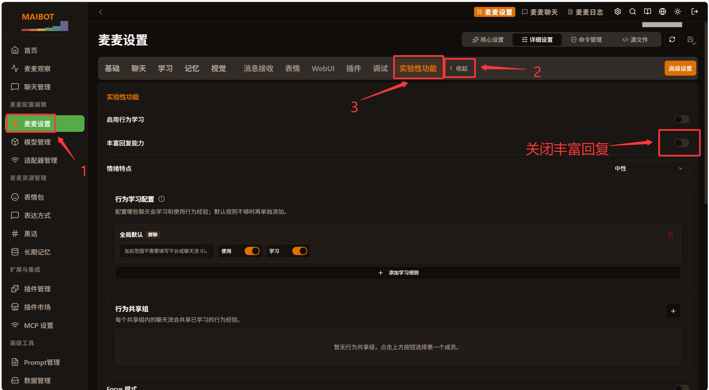
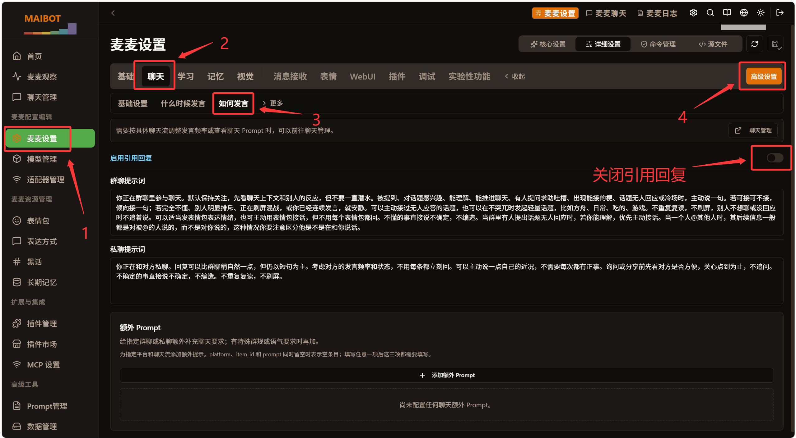
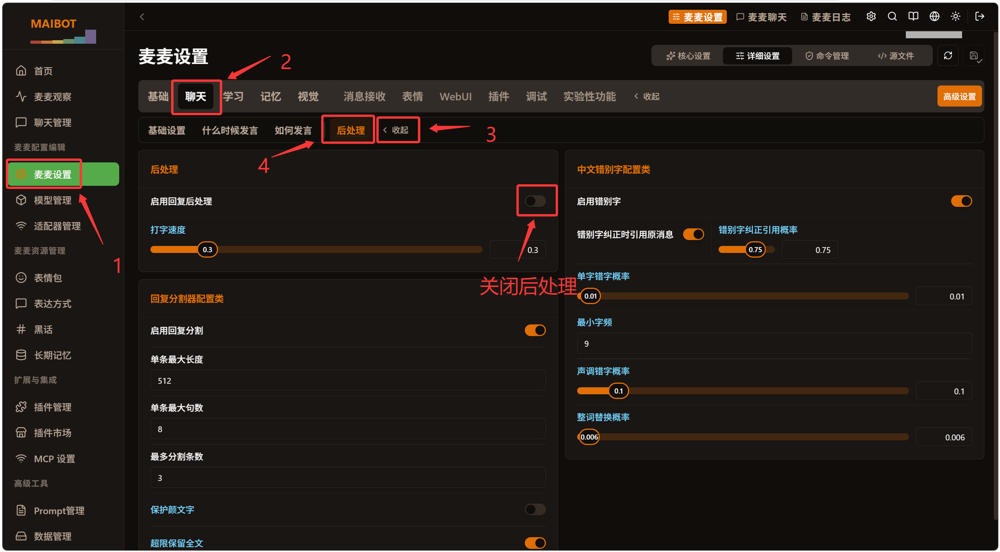

# 更好的消息后处理

## 使用前必读：先关掉宿主这几个开关（否则接管能力不生效）

> ⚠️ **本插件的两个「接管」能力（引用回复接管 / 后处理接管）不是装上就能用。**
> 它们要求宿主**关掉自己的原生能力** —— 否则宿主会先处理完，插件没有任何介入空间，
> 表现为**装了却一点效果都没有**（日志里对应模块会显示 `静默` 并写明原因）。
>
> 下面 3 个宿主开关**必须关闭**，顺序就是优先级：

| 优先级 | 要关闭的宿主开关 | 在哪里关 | 不关的后果 |
|---|---|---|---|
| **1️⃣ 最优先** | **丰富回复能力** | 麦麦设置 → **实验性功能** → 丰富回复能力 → 关 | **所有接管能力全部失效**（引用回复接管 + 后处理接管都不生效） |
| 2️⃣ | **启用引用回复** | 麦麦设置 → 聊天 → 如何发言 → **更多** → 高级设置 → 启用引用回复 → 关 | 「引用回复接管」失效 |
| 3️⃣ | **启用回复后处理** | 麦麦设置 → 聊天 → 后处理 → 启用回复后处理 → 关 | 「后处理接管」失效（分段 / 错别字纠正）。**例外（1.1.1 起）**：保持它开启、但关闭「启用错别字」也可以——此时由插件**接管错别字与分段**（见 [模块与前置条件](#模块与前置条件重要)） |

> 如需查看指引教程的图片，请前往本地或仓库github查看，maibot的webui当前不支持加载本地静态资源

### 1️⃣ 关闭「丰富回复能力」（最关键，先关这个）

麦麦设置 → **实验性功能** → 把「丰富回复能力」的开关**关掉**：



> **为什么它最优先**：丰富回复开启后，回复工具会给消息挂图片 / 表情 / @ 等附件，分段与引用语义
> 都由富回复链路接管 —— 插件判定「首段文本」、注入引用都会与宿主打架。**不关它，下面两项关了也没用。**

### 2️⃣ 关闭「启用引用回复」

麦麦设置 → **聊天** → 「如何发言」→ 点右侧的 **更多** → 高级设置 → 把「启用引用回复」**关掉**：



> 📌 **「更多」与「收起」是同一个按钮**：**未展开时显示为「更多」，展开后才显示为「收起」。**
> 找不到高级设置时先点它展开 —— 折叠状态下长这样：
>
> 

### 3️⃣ 关闭「启用回复后处理」

麦麦设置 → **聊天** → **后处理** → 把「启用回复后处理」**关掉**：



> **1.1.1 起的例外**：这一项也可以**不关**——只要把「启用错别字」（同页上方）关掉，
> 后处理接管同样生效（**错别字接管**：宿主后处理开启但错别字关闭时，由插件接管错别字与分段；
> 插件接管后会跳过宿主自身的处理，两者不会重复）。两种口径的效果差别只在
> `[chinese_typo] enable` 的「跟随宿主」语义，见[错别字板块说明](docs/CONFIG.md#chinese_typo-错别字)。

### 关完之后应该看到什么

启动 / 热重载后，日志里这三行应该是「可用」（后处理接管按所选口径显示完整接管或错别字接管）：

```text
[模块状态｜启动] 引用回复接管：可用（启用引用回复已关闭、丰富回复已关闭）
[模块状态｜启动] 后处理接管：可用（丰富回复已关闭、启用回复后处理已关闭（完整接管：错别字 + 分段））
[模块状态｜启动] 后处理接管：可用（丰富回复已关闭、启用错别字已关闭（错别字接管：宿主后处理开启时由本插件接管错别字与分段））
[模块状态｜启动] 回复后表情包：可用（不受宿主开关约束）
```

**其余功能（回复后表情包 / 表情包跟风 / 聊天流表情冷却 / 文本替换规则 / 表情包含义库 /
`/bpp` 状态命令）不需要关闭宿主任何功能**，宿主开关任意状态都照常工作。

> 想「开着丰富回复也强行接管」时，把插件配置 `[plugin] rich_reply_gate` 关掉（默认开）——
> 代价见 [模块与前置条件（重要）](#模块与前置条件重要)。

---

Maibot出站消息增强插件，提供下列可分别开关的独立功能：

| 功能 | 默认 | 说明 |
|---|---|---|
| 后处理接管 | 开 | **需宿主不在做错别字处理**：`response_post_process.enable_response_post_process = false`（完整接管）**或** `response_post_process.enable_response_post_process = true` 且 `chinese_typo.enable = false`（错别字接管，1.1.1 起），且 `experimental.enable_rich_reply = false`：以与 MaiBot 一致的原逻辑接管错别字注入 + 分段 + 颜文字保护 + 长度/句数守卫（参数沿用宿主 `response_splitter.*` / `chinese_typo.*` / `typing_speed`；分段复刻已同步 MaiBot 1.3.0 的分段合并修复）；**各分段作为独立消息依次发送**（首段走宿主原生链路，其余由插件补发并模拟打字）；**错字纠正方式恒由权重池决定**（直接发送 / 引用纠正 / 撤回重发 / 不纠正，可延迟到最后；撤回前有「撤回反应时间」），`@昵称` 不会被错字污染、也不会重复 @ |
| 引用回复接管 | 开 | **需宿主关闭** `chat.reply_style.enable_reply_quote` **与** `experimental.enable_rich_reply`：为指向目标消息的回复**按权重**抽取发送方式：直接回复 / 引用回复 / @回复 / 引用＋@回复；**群聊与私聊权重、过旧规则、"同一消息只引用一次"记录各自独立**（私聊恒不 @） |
| 同一消息只引用一次 | 开 | 一条目标消息被引用过之后，之后对该消息的任何回复都不再引用（群聊/私聊分开记录）；抽到直接回复不消耗机会 |
| 回复后表情包 | 开 | planner 激活回复后，若整轮回复没有携带表情包，按概率补发一张（指定情绪标签或随机）；planner 本轮已计划发表情/贴表情、或本轮回复实际没发出时不补发 |
| 表情包跟风 | 开 | 群友连续发送 `threshold` 条表情包后，按配置方式跟发一张（与最后一个同情绪 / 指定情绪 / 纯随机）；不计入 bot 自身消息与插件注入的合成记录 |
| 文本替换规则 | 空 | 对 bot 发出的纯文本做词替换或整条覆盖，可配多条；默认只作用于 planner 拉起的回复流程，不碰其它插件直接发出的文本 |
| 表情包含义库 | 开 | 为表情包补录视觉模型生成的"准确内容"，并在发给模型的请求里把 `[表情包: 标签]` 改写成标签 + 内容描述（默认改 replyer 与 planner 请求） |
| 异常兜底提示词 | 空 | 后处理接管触发「过长 / 句子太多」兜底时，从自定义列表**随机抽一条**发送（支持 `{bot_name}` / `{user_name}` 占位）；留空 = 只用宿主自带的兜底提示词 |
| 错字黑名单 | 空 | （1.1.3）名单里的**字或词**不会被错字命中，保持原样：填字 = 该字不被改成错字、别的字也不会被错改成它；填词 = 整词不被替换且词内每个字一并受保护。用来护住人名、专有名词、关键字。**留空 = 关闭** |
| 空回复兜底 | **关** | （1.1.3）replyer **一条正文都没生成**时（模型返回空内容，或后处理前 Hook 把正文清空），补一条兜底消息，避免"bot 已读不回"。文本复用上面的「异常兜底提示词」；有工具调用 / 已有正文 / 同一轮已补过时不介入。**默认关闭** = 与宿主行为完全一致 |
| 私聊禁用撤回 | **开** | （1.1.3）**私聊里根本不抽「撤回重发」**——`recall` 在**抽签阶段**就从权重池里剔除，剩余方式（`direct` / `quote` / `none`）按原权重比例重新归一化抽取，所以私聊里不会产生任何撤回动作，也不是"抽到撤回再降级"。原因：私聊中 bot 撤回自己的消息时，适配器会把这条撤回**显示成「是用户撤回了消息」**，于是 bot 的上下文里凭空多出"对方撤回了一条消息"——它会误以为是用户撤回了什么，从而被错误引导（追问、道歉）。**群聊不受影响**（群里撤回就是 bot 自己撤回，语义正确）。**默认开启**；关闭 = 私聊也照常从池子里抽撤回（回到旧行为） |
| /bpp 状态命令 | 恒可用 | **仅 operator 可用**（宿主 `plugin.permission` 名单 + 本地控制台，非 operator 由宿主拦截）。`/bpp` 用**合并转发**发送各模块当前状态（**一图流**渲染，渲染失败退回文字）；`/bpp fallback` 引用一条消息实测兜底提示词（插件总开关关闭时拦截） |

> ⏱️ **多段发送的等待行为（体验说明，1.1.2 起置顶）**：分段补发期间，两个 BLOCKING 等待钩子
> 会把**新入站消息 / planner 请求**先挡住等补发完成——极端情况下（补发卡住且
> `wait_timeout_seconds` 调到 55 以上）新消息处理**最多延迟约 55 秒**（等待 Hook 上限
> 58 秒 − 3 秒收尾余量；默认 `wait_timeout_seconds = 30`，本就低于该钳制点）。插件加载且
> 接管生效时，启动日志会重申这条上限。**不想等待**：把 `[response_splitter]
> wait_timeout_seconds` 调小或设 `0`（完全不等待）。机制细节见
> [docs/CONFIG.md](docs/CONFIG.md) 的「发送形态（复刻宿主分段发送）」。

<!-- TOC -->

## 目录

- [使用前必读：先关掉宿主这几个开关（否则接管能力不生效）](#使用前必读先关掉宿主这几个开关否则接管能力不生效)
- [安装](#安装)
- [模块与前置条件（重要）](#模块与前置条件重要)
- [配置](#配置)——完整配置文档拆分至 [docs/CONFIG.md](docs/CONFIG.md)
- [/bpp 状态命令与异常兜底提示词（1.0.0）](docs/BPP_COMMAND.md)
- [与框架的分工 / 与其它插件共存](docs/COEXISTENCE.md)
- [能力声明（capabilities）](#能力声明capabilities)
- [开发](#开发)
- [参考实现与出处](#参考实现与出处)
- [作者与许可](#作者与许可)
- [致谢](#致谢)

<!-- /TOC -->


## 安装

把整个 `cateye_better_post-processing` 目录放进 MaiBot 安装目录的 `plugins/` 下，
然后重启 MaiBot（或在 WebUI 插件管理中启用本插件）。

> 本插件使用的 Hook 与能力（`send_service.before_send` / `send_service.after_build_message` /
> `send_service.after_send`、`maisaka.reply.before_post_process`、`maisaka.replyer.after_response`、
> `maisaka.planner.before_request`、`maisaka.planner.after_response`、
> `maisaka.replyer.before_model_request`、`chat.receive.before_process`、`chat.receive.after_process`、
> `emoji.register.after_build_description`、`emoji.maisaka.before_select`、`message.get_by_id`、`message.get_by_time_in_chat`、
> `emoji.*`、`config.get`、`database.query`、`llm.generate`、`send.emoji`、`send.text`、
> `send.forward`、`send.image`、`render.html2png`、`api.call`）在 MaiBot 1.2.3 / 1.3.0
> 与 maibot_sdk 2.8.0 / 2.8.2 上验证。manifest 声明的最低宿主版本为 1.2.3。
>
> 多段发送（`[response_splitter]` 的 `takeover`）需要 `send.text` 能力，
> 「撤回重发」纠错分支需要 `api.call` 能力，`/bpp` 状态命令需要 `send.forward`（合并转发）、
> `render.html2png`（一图流）与 `send.image`（转发降级直发），**改动过 manifest 需完整重启 MaiBot**。

**版本变更**见 [`CHANGELOG.md`](CHANGELOG.md)（1.0.0 起记录功能变更，更早版本按次级版本号合并回溯）。

## 模块与前置条件（重要）

> 📌 **图文操作步骤（含宿主设置截图）见 [使用前必读](#使用前必读先关掉宿主这几个开关否则接管能力不生效)**；
> 本节是同一件事的**规则化说明**（哪个模块需要哪些宿主配置、读不到配置时怎么处理）。

插件按"接管对象"拆成独立模块（代码在 `modules/` 子目录）。**两个接管模块必须由宿主关闭对应能力
才会工作**——否则即使插件配置里把它们打开，模块也会**完全静默**：不改写文本、不抽取回复方式、
不发任何消息。启动时与**每次配置变更时**都会在日志里打印各模块的可用状态：

```text
[模块状态｜启动] 引用回复接管：静默（需在宿主配置关闭「丰富回复」（experimental.enable_rich_reply，当前 True））
[模块状态｜启动] 后处理接管：可用（丰富回复已关闭、启用回复后处理已关闭（完整接管：错别字 + 分段））
[模块状态｜启动] 回复后表情包：可用（不受宿主开关约束）
```

| 模块 | 需要的宿主配置（**全部满足**才可用） | 是否受制 |
|---|---|---|
| 引用回复接管（`quote_reply`） | `chat.reply_style.enable_reply_quote = false` 且 `experimental.enable_rich_reply = false` | 受制 |
| 后处理接管（`response_splitter`） | `response_post_process.enable_response_post_process = false`（**完整接管**）**或** `chinese_typo.enable = false`（**错别字接管**，宿主后处理开启但错别字关闭——1.1.1 起），二选一；且 `experimental.enable_rich_reply = false` | 受制 |
| 回复后表情包 / 表情包跟风 / 表情包含义库 / 文本替换规则 / 空回复兜底 | —— | **不受制**，宿主开关任意状态都照常工作 |

> **后处理接管的两条满足路径（1.1.1 起）**：核心判据是"**宿主不在做错别字处理**"——
> ① 宿主后处理总开关关闭 → 插件完整接管（错别字 + 分段，1.0.0 起的原行为）；
> ② 宿主总开关开启但宿主错别字关闭 → 插件接管错别字与分段（接管后置
> `skip_post_process=True` 跳过宿主自身的处理，两者不会重复；分段与错别字由插件按
> 宿主参数复刻执行）。宿主"总开关开 + 错别字开"时插件才完全静默（宿主自己处理）。

> **为什么两个接管都要关「丰富回复」**：开启后回复工具会给消息挂图片/表情/@ 等附件，分段与引用语义
> 都由富回复链路接管，插件的"首段文本"判定与引用注入会与宿主打架。这也是官方文档要求的使用前提。
>
> 想"开着丰富回复也要接管"时，把插件配置 `[plugin] rich_reply_gate` 关掉即可（默认开）：
> 此时不再把丰富回复当硬门槛，状态行会写成 `可用（…、丰富回复未做门控）`。代价是附件只挂在
> **首段**、补发分段不带附件，与宿主原生"附件挂最后一段"的语义不同，请自行确认可接受。
>
> 读不到宿主配置时（能力异常）按**未满足**处理，模块保持静默并在日志里写明原因——宁可少做事，
> 也不要和宿主原生能力重复处理同一条消息。
>
> 日志级别：可用模块用 `info`、**静默模块用 `warning`**——"配置打开了却什么都不做"最难排查，
> 静默原因必须显眼。


## 配置

配置文件位于 `plugins/cateye_better_post-processing/config.toml`（或 WebUI 插件配置页），
按功能板块排版；**留空 = 跟随宿主**（首次生成配置时会读宿主现值填入，想重新跟随宿主就清空）。

完整的配置文档已拆分到 **[docs/CONFIG.md](docs/CONFIG.md)**，包括：

- 配置板块总览与三条通用规则（含「跟随宿主」的四级取值链路）；
- 全部字段的取值范围与校验表（共 33 项有范围约束）；
- 各板块字段表与行为说明：`[plugin]` / `[quote_reply]`（含权重） / `[quote_reply_private]` /
  `[chinese_typo]`（含纠正方式权重、错字黑名单） / `[response_splitter]`（分段、打字速度、异常兜底、
  等待与 55 秒钳制） / `[empty_reply_fallback]`（空回复兜底） / `[emoji_after_reply]` /
  `[emoji_follow]` / `[emoji_cooldown]` / `[text_rules]` / `[emoji_meaning]`；
- WebUI 显示与翻译说明。

`/bpp` 状态命令与 `/bpp fallback` 详见 [docs/BPP_COMMAND.md](docs/BPP_COMMAND.md)；
与「智能分段插件」等其它插件的共存见 [docs/COEXISTENCE.md](docs/COEXISTENCE.md)。

## 能力声明（capabilities）

manifest 声明 **14** 项能力，与代码里的实际调用一一对应（审核时用 AST 双向对账过：
`self.ctx.<代理>.<方法>` 收集到的能力集合与 manifest **完全相同**，既没有"声明了没用到"，
也没有"用了没声明"；`ctx.logger` / `ctx.paths` 不是能力代理，不计入）：

| 能力 | 用途 |
|---|---|
| `api.call` | 走适配器公开 API 撤回消息（「撤回重发」纠错分支）。**口径说明**：`api.call` 本身是能触达适配器任意动作的宽口径能力，本插件只调**两个写死的撤回入口**（`adapter.napcat.message.delete_msg` 与兜底的 `adapter.napcat.action.call`，同一个 `delete_msg` 动作的两种适配器形态），且 `message_id` 一律取自**插件自己刚发出的消息**的发送回执——只撤自己刚发出去的消息，不撤用户消息、不调其它任何动作 |
| `config.get` | 读宿主配置（模块前置条件判定、`留空 = 跟随宿主`） |
| `message.get_by_id` | 取被回复消息（@ 目标、目标时间戳用于过旧判定、`/bpp fallback` 回查被引用消息的发送者） |
| `message.get_by_time_in_chat` | 统计"目标之后已有多少条消息" |
| `emoji.get_by_description` / `emoji.get_random` / `emoji.get_count` | 表情包抽取、含义库抽样与统计 |
| `database.query` | 读宿主表情库的 **`Images` 表**：按图片 hash 查 `full_path`，含义生成时定位表情包文件（配置读取不走这里——宿主 `[chinese_typo]` 等配置走 `config.get` 与首次生成时的 `bot_config.toml` 直读，0.14.3 文案修正） |
| `llm.generate` | 表情包含义的视觉模型生成 |
| `send.emoji` | 补发 / 跟发表情包 |
| `send.text` | 补发第 2..N 段与错字更正段；`/bpp` 的文字兜底与用法提示 |
| `send.forward` | `/bpp` 用合并转发发送模块状态（单节点：一图流 image 段，渲染失败退 text 段） |
| `send.image` | `/bpp` 合并转发失败时直发状态一图流（降级链 转发 → 图片 → 文字） |
| `render.html2png` | `/bpp` 状态卡片的一图流渲染（全内联样式、不访问外网、动态文本转义） |

> **`api.call` 必须在 manifest 里声明**：宿主 `plugin_runtime/host/authorization.py` 的
> 免声明白名单**只有** `api.replace_dynamic` 一项，其余能力一律按 manifest 令牌放行。
> 0.11.1 及更早漏声明了 `api.call`，宿主返回 `E_CAPABILITY_DENIED` 被插件吞成 debug 日志，
> 结果是**「撤回重发」永远静默退化成 `recall_fallback`**（0.11.2 修复）。

插件**不访问宿主内部模块**（无 `import src.*`）、**不写**宿主文件系统、**不碰**宿主的数据库文件；
数据访问全部走公开能力代理，另有两处**只读**的宿主文件读取（如下）。

**宿主数据访问（全部走公开能力代理）**

- 读库走 `database.query`（唯一用途：按图片 hash 查 `Images` 表拿 `full_path`，
  含义生成时取图）；**不删**宿主消息库里的任何记录
  （0.12.0 起 `database.delete` 与「撤回后清理原消息」一并移除，见上）；
- 读宿主配置走 `config.get` 能力（模块前置条件判定、`留空 = 跟随宿主`）；
- 撤回走 `api.call` 调适配器公开动作（`adapter.napcat.message.delete_msg`，
  `action.call` 兜底），只撤**插件自己刚发出**的消息（见上方能力表口径说明）；
- 自有数据（表情包含义库 `emoji_meanings.db`、`config.toml`）落在 `ctx.paths.data_dir` 与插件目录内。

**直接读宿主文件系统的两处（都是只读）**

| # | 读什么 | 用途 | 防护 |
|---|---|---|---|
| 1 | `config/bot_config.toml` | 首次生成插件配置时把宿主现值填成默认值（`get_default_config`） | 只读、失败即回退"留空 = 跟随宿主" |
| 2 | 表情包图片：`data/images/<hash>.<ext>` 或 `Images.full_path` | 含义库生成时取图（`_load_emoji_bytes_by_hash`） | **根目录包含校验**（拒绝宿主根之外的路径）+ **单文件 8MB 上限** + **hash 64 位十六进制格式校验**（1.1.2 起，不合法直接拒绝） |

> 第 2 处在 Docker / 远程部署（宿主文件不在本机）时自然失败，此时交给 `emoji.get_random`
> 抽样兜底 —— 这是设计内的降级，不是错误。

**插件的写文件行为：只建自己的数据目录，不写任何配置文件。**

- `config.toml`：**只读**。由宿主生成与维护（首次生成 / 配置版本变化 / WebUI 保存），
  插件的 `get_default_config()` 只**提供默认值**给宿主；
- 唯一的写操作是 `mkdir` 自己的数据目录（`ctx.paths.data_dir`，存放 `emoji_meanings.db`）；
- 宿主 `bot_config.toml`、宿主字频表等一律**只读**（带根目录包含校验与大小上限）。

## 开发

- **模块结构**（0.10.1 起）：

  | 文件 | 职责 |
  |---|---|
  | `plugin.py` | 配置模型、生命周期、共享基础设施（回复轮记录、文本规则、表情包功能），组合下面四个 mixin |
  | `modules/requirements.py` | 各模块的宿主前置条件与可用性判定（纯逻辑，可离线单测） |
  | `modules/post_process_takeover.py` | 后处理接管：Hook 1~5 + 多段发送 + 补发缓存 + 异常兜底提示词占位替换 |
  | `modules/empty_reply_fallback.py` | 空回复兜底（1.1.3，默认关闭）：replyer 一条正文都没生成时补发一条兜底消息 |
  | `modules/quote_takeover.py` | 引用回复接管：权重抽取 + 过旧规则 + 同一消息只引用一次 |
  | `modules/status_command.py` | `/bpp` 状态命令（合并转发 + 一图流渲染 + 文字兜底）与 `/bpp fallback` 兜底测试（1.0.0） |
  | `post_processing.py` | 宿主后处理算法逐行复刻（纯逻辑，可离线单测）+ 兜底提示词抽取 |
  | `emoji_meanings.py` / `text_rules.py` | 表情包含义库存储与提示词 / 文本规则解析 |

  各接管 / 兜底模块与命令模块以 **mixin** 形式被插件类继承——SDK 用 `dir(instance)` 收集组件，继承来的
  `@HookHandler` / `@Command` 一样会被注册；共享状态（`self._reply_rounds` 等）通过 `self` 访问。

- 新增/调整"需要宿主关闭某能力"的模块时，只需改 `modules/requirements.py` 的
  `MODULE_REQUIREMENTS`，门控与启动日志会自动跟随。
- `post_processing.py`（后处理复刻）与 `text_rules.py`（文本规则解析）为纯逻辑模块（不依赖
  SDK），可离线单测；后处理复刻依赖 `jieba` / `pypinyin`（宿主 venv 自带），缺失时只有
  "后处理接管"降级，插件其它功能照常工作，加载时日志会给出明确报错。
- 修改配置用 WebUI 热重载即可；改 `_manifest.json`（能力声明）需完整重启 MaiBot。

## 参考实现与出处

- **派生自 MaiBot**（<https://github.com/Mai-with-u/MaiBot>，**GPL-3.0**）：`post_processing.py`
  复刻并**部分逐字复制**了宿主 `src/chat/utils/utils.py`（`process_llm_response_segments`）与
  `src/chat/utils/typo_generator.py`（`ChineseTypoGenerator`），分段复刻已同步 MaiBot 1.3.0 的
  回复分割修复。这是本插件按 GPL-3.0-or-later 发布的原因，详见[作者与许可](#作者与许可)。
  **与宿主有意不同的几处**（README 各功能节有更详细的说明）：整词同音替换的候选组合数加了
  硬上限（宿主穷举 `itertools.product` 无上限，长词会指数爆炸卡住线程）；`@昵称` 不参与错字
  生成；异常兜底提示词可自定义。
- **参考了**[saberlights/smart_segmentation_plugin](https://github.com/saberlights/smart_segmentation_plugin)
  （作者久远，GPL-3.0-or-later）的**多段发送思路**（`send_service.after_build_message` 登记待补发
  → `send_service.after_send` 用 `ctx.send.text(typing=…)` 补发 → `maisaka.planner.before_request` /
  `chat.receive.before_process` 时序守卫）；该部分的实现为**独立编写**：无成段代码复制
  （最长连续相同代码为 3 行通用惯用法），同名函数体相似度 ≤20.7%，重合的长行均为宿主公开接口名
  与载荷键名，文档/注释无重合。相似性取证脚本与结论见
  `smart_segmentation_plugin-main/LICENSE-审查-协议义务分析.md` 与同目录 `check_license_similarity.py`。

## 作者与许可

- **作者**：cateye（<https://github.com/cateyemizuki>），仓库
  <https://github.com/cateyemizuki/cateye_better_post-processing>。
- **许可证**：**GPL-3.0-or-later**（见 [`LICENSE`](LICENSE)）。

> 为什么是 GPL 而不是 MIT：本插件的 `post_processing.py` **派生自 MaiBot**
> （<https://github.com/Mai-with-u/MaiBot>，**GPL-3.0**）的 `src/chat/utils/utils.py` 与
> `src/chat/utils/typo_generator.py`——分段、颜文字保护、长度/句数守卫、错字候选与概率等逻辑与上游
> **逐行一致**，其中相当一部分是**逐字复制**（含正则字面量与中文行内注释）。按上游同一协议发布是
> 分发该派生代码的前提。**因此本插件整体按 GPL-3.0-or-later 提供**：你可以自由使用、修改、再分发，
> 但再分发时必须同样开源、保留版权与许可声明。若你只需要 MIT 的代码，请勿使用本插件。

## 致谢

- 特别感谢 **[saberlights/smart_segmentation_plugin](https://github.com/saberlights/smart_segmentation_plugin)**
  （作者**久远**）——本插件的**多段发送机制**参考了它的思路，0.10.4 起又靠它与本插件的
  **让位机制**和平共存（见[与其它插件共存](#与其它插件共存)）。没有它先把"接管宿主分段"这条路
  蹚出来，本插件不会在 0.10.0 去逐项复刻宿主的分段链路。**感谢久远与这个项目。**
  如果你的需求是"更主动、更激进的分段"，请直接使用它——本插件的分段只在宿主总开关关闭时兜底。
- 感谢 **MaiBot**（[Mai-with-u/MaiBot](https://github.com/Mai-with-u/MaiBot)）与其插件体系
  （`maibot_sdk`）：本插件的分段与错别字逻辑派生自宿主源码，全部宿主数据访问都走宿主公开能力。
